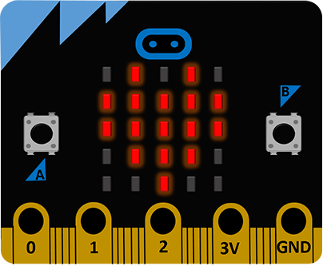
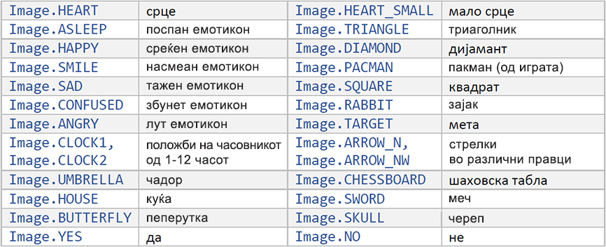
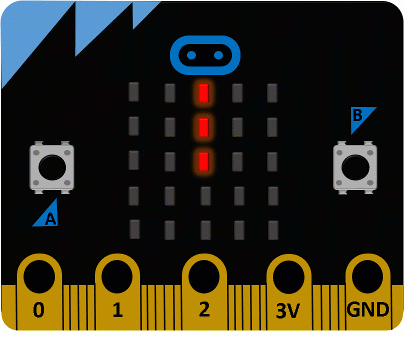
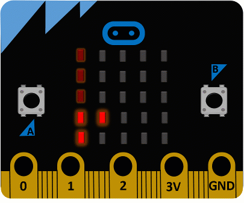
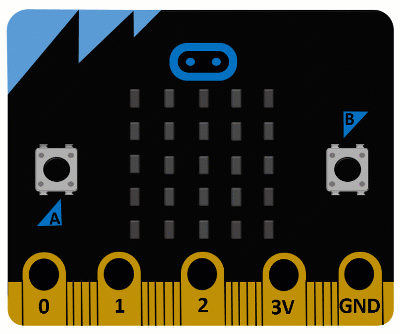
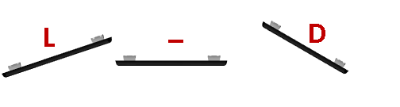
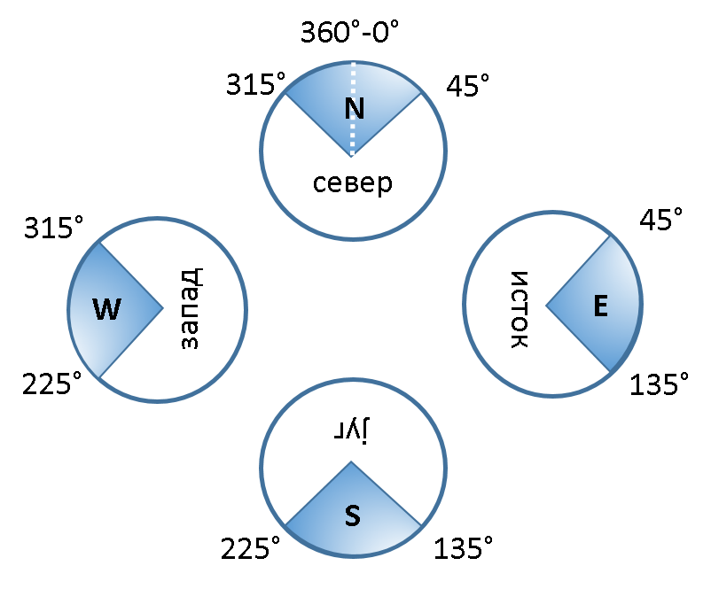
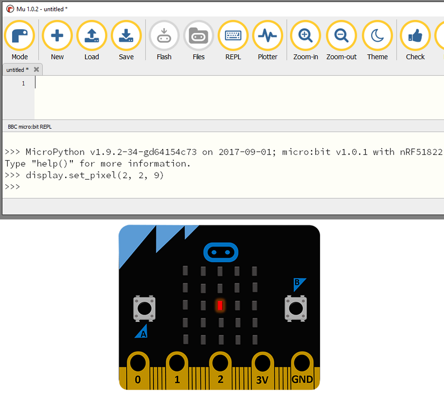
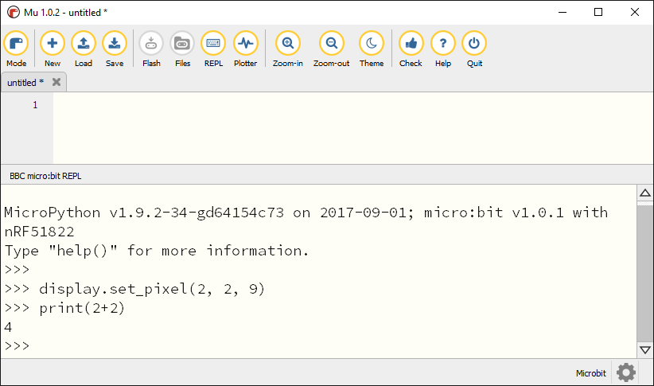
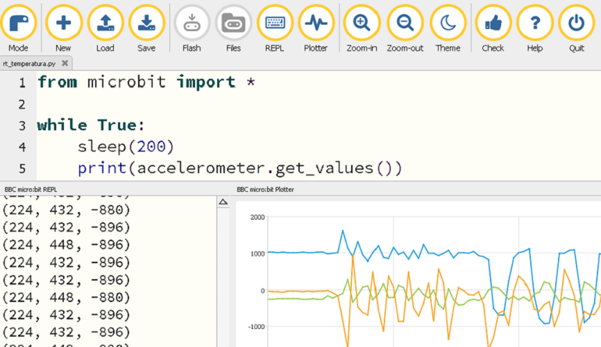

===============
Основни функции
===============

|

Веќе се запознавте со начинот на програмирање со програмскиот јазик Python, со правилата за пишување наредби и основните карактеристики на јазикот. Новина во поглед на претходната програма Python е примената на функциите за управување со уредот Микро:бит, кои се дефинирани во библиотеката која е предвидена за нив.

Функциите кои ни се потребни се дефинирани во библиотеката на уредот *Микро:бит* и преку следните примери ќе научиме како да ги вчитуваме и применуваме во нашиот код, а потоа и како да го вчитаме кодот во уредот *Микро:бит* и да ги провериме резултатите од нашите задачи. 

|

Вклучување на библиотеката
--------------------------

Библиотеката на уредот *Микро:бит* ја вклучуваме во нашиот код со помош на наредбата *import*. Наредбата *import* ќе ја употребуваме во следната форма:

.. activecode:: fragment_import_microbit
   :passivecode: true
   :coach:
   :includesrc: src/OsnovneFunkcije/fragment_import_microbit.py

Оваа наредба ни овозможува да ги користиме сите функции кои се достапни во библиотеката *Микро:бит* и со неа ќе започнува секој наш иден код.

|

Управљање екраном
-----------------

Некои од основните функции со кои може да управуваме со екранот се следниве:

.. infonote::

	- **display.scroll(porаka)**
	- **display.show(slika)**
	- **display.show(lista_na_sliki)**
	- **display.clear()**
	- **display.read_light_level()**
	- **display.on()**
	- **display.off()**

	
Напоменавме дека екранот на уредот *Микро:бит* се состои од 25 светлечки диоди кои се распоредени во пет редови и пет колони. Екранот го користиме за да напишеме разни пораки (текст), да прикажеме слики (икони) или вредности кои ги отчитуваме од разни вградени или дополнителни сензори. Основната функција за прикажување текст е *display.scroll* и може се употреби на следниов начин:

.. activecode:: fragment_display_scroll
   :passivecode: true
   :coach:
   :includesrc: src/OsnovneFunkcije/fragment_display_scroll.py

Потребно е да го ставиме во заграда текстот што сакаме да се прикажува, како параметар на оваа функција. Како потсетување, текст во *Python* се пишува во наводници или меѓу два апострофа. Текстот ќе се испише еднаш, на начин на кој *ќе поминува низ екранот* од десно кон лево.  

|

За прикажување слики (икони) се користи функцијата *display.show*, која исто така е дел од библиотеката на уредот *Микро:бит*. Употребата на оваа функција изгледа вака: 

.. activecode:: Dojavljivac_zore
   :passivecode: true
   :coach:
   :includesrc: src/OsnovneFunkcije/fragment_display_show.py

Во овој случај, на екранот од уредот *Микро:бит* би требало да се појави срце:

|

|

Постојат голем број дефинирани икони меѓу кои се и следниве: 

|

Доколку сакате самите да нацртате слика и да ја прикажете, тоа може да го сторите на следниов начин:

.. activecode:: fragment_display_show_2
   :passivecode: true
   :coach:
   :includesrc: src/OsnovneFunkcije/fragment_display_show_2.py

Нацртавме *brod*. Секоја вредност од 0-9 одредува колку ќе свети соодветната диода на екранот (0 – исклучена диода, 9 – диода која свети најсилно). Диодите почнуваат да светкаат ред по ред, од горе надолу, а во секој ред од лево на десно. На пример, првата група од 5 цифри ги активира да светат диодите во горниот ред на екранот. 

**Забелешка**: Можеби на почеток ќе ви биде попрегледно да ги запишувате вредностите една под друга, како на пример:

.. activecode:: fragment_display_show_3
   :passivecode: true
   :coach:
   :includesrc: src/OsnovneFunkcije/fragment_display_show_3.py

|

За да ја избришеме моменталната содржина на екранот ја користиме функцијата:

.. activecode:: fragment_display_clear
   :passivecode: true
   :coach:
   :includesrc: src/OsnovneFunkcije/fragment_display_clear.py

|

Повеќето прирачници за учење програмски јазици започнуваат со пишување на класичната порака **„Zdravo na site!“** (*Hello world!*). Таквиот код за уредот *Микро:бит* во *Python* е многу едноставен – доволно е да се напишат само две линии: 
	
.. activecode:: zdravo_svima
   :passivecode: true
   :coach:
   :includesrc: src/OsnovneFunkcije/zdravo_svima.py

|
	
Ова е нашиот прв целосен код кој е подготвен за извршување на уредот Микро:бит. Ќе провериме дали е функционален нашиот код.

.. infonote::

	Откако ќе го внесете кодот во уредувачот *Мu*, проверете дали сте направиле некаква грешка (*Check*). Доколку има грешка, откако ќе ја поправите зачувајте ја промената (*Save*) и вчитајте го кодот во уредот *Микро:бит* (*Flash*). Додека се вчитува кодот во уредот *Микро:бит* неколку секунди ќе трепка жолтата диода која се наоѓа на неговата задна страна. 
	
|

**Пример 1:**

.. questionnote::

	Напишете код којшто овозможува на уредот *Микро:бит* да се испише пораката *Здраво!* и да се прикаже срце. Оваа активност треба да се повторува додека е вклучен уредот *Микро:бит*.

Решење:

.. activecode:: zdravo_i_srce
   :passivecode: true
   :coach:
   :includesrc: src/OsnovneFunkcije/zdravo_i_srce.py

Да го разгледаме детално овој едноставен код и да се увериме дека сме го разбрале секој дел од кодот. 

Првиот ред од кодот ја вклучува библиотеката со функции за работа со уредот *Микро:бит*.

Во јамката што почнува во третиот ред, условот во наредбата *while* е секогаш исполнет. Со тоа се постигнува да се повторува извршувањето на наредбите кои следуваат сè додека е вклучен уредот *Микро:бит* (или додека во него не се вчита некој друг код). На уредот *Микро:бит* ќе се прикаже пораката “Zdravo!“, а две секунди подоцна ќе се прикаже и срце. Тоа ќе се повторува неограничен број пати. 

На крајот од секое поминување низ јамката правиме пауза во времетраење од две секунди. За да го постигнеме тоа ја користиме функцијата *sleep*, која општо изгледа вака:

.. activecode:: fragment_sleep
   :passivecode: true
   :coach:
   :includesrc: src/OsnovneFunkcije/fragment_sleep.py

|

**Пример 2:**

.. questionnote::

	**Напишете код којшто одбројува од пет до нула и потоа прикажува дијамант.**

Решење:

.. activecode:: odbrojavanje
   :passivecode: true
   :coach:
   :includesrc: src/OsnovneFunkcije/odbrojavanje.py

Променливата *broj* ќе зазема вредности од пет до нула, со тоа што секој пат ќе се смалува за еден (третиот број во заграда).

- Кои броеви би се прикажале доколку наместо овие вредности во заградата стојат (0, 10, 2)?

- Што би се случило доколку наместо функцијата *display.show* употребиме *display.scroll*? Која од овие две функции би ја употребиле попрво доколку се работи за двоцифрени броеви? Обидете се да го сторите тоа! 

|

Овој пат ја употребивме функцијата:
	
.. activecode:: fragment_str
   :passivecode: true
   :coach:
   :includesrc: src/OsnovneFunkcije/fragment_str.py

Таа ни овозможува некоја вредност на број (на пример, податок отчитан од некој сензор) да го претвориме во текст за да го прикажеме на екранот. Доколку се обидете да прикажете број без претходно да го претворите во текст, ќе забележите дека и тоа е возможно. Меѓутоа, во другите програмски јазици претворањето во текст е може да биде неопходно, па затоа, за да создадеме навика, ќе го правиме тоа и понатаму во кодовите.

|

**Пример 3:**

.. questionnote::

	**Напишете код со којшто на екранот ќе се исцрта положбата на стрелката од часовникот (стрелката нека се поместува на секои две секунди).**

|	
		

|

Решење:

.. activecode:: kazaljka
   :passivecode: true
   :coach:
   :includesrc: src/OsnovneFunkcije/kazaljka.py

За овој пример се послуживме со веќе постоечката слика *Image.ALL_CLOCKS*, а кога со функцијата *display.show* ќе ја проследиме листата со слики таа ќе ја прикажува по ред секоја слика од листата. Поради тоа што е потребно паузата помеѓу секоја слика да трае една секунда, покрај неа дефиниравме и рамка за повикување на функцијата. Кога ќе ја повикаме оваа функција, може да наведеме во заграда и вредност со следните параметри: 

- **wait** - на пример, *wait = Тrue* aко сакаме кодот да почека да се заврши анимацијата пред да продолжи со следниот чекор;

- **loop** - *loop = Тrue*, aкo сакаме анимацијата да се повторува неограничен број пати;

- **clear** *clear = Тrue*, ако сакаме да ја избришеме содржината на екранот по извршената анимација.

**Забелешка:** Освен ако не наведеме поинаку, се подразбираат следниве вредности за овие параметри: *delay = 400, wait = Тrue, loop = False, clear = False*

|

**Пример 4:**

.. questionnote::

	**Напишете код којшто прикажува брод што плови (анимација).**

|
	

|

Решење:

.. activecode:: brod_koji_plovi
   :passivecode: true
   :coach:
   :includesrc: src/OsnovneFunkcije/brod_koji_plovi.py

Ако ви е поедноставно, може да ги испишете една под друга вредностите од светнувањето на диодите по редови (како што објаснивме претходно). 

- Изменете го кодот за да се изврши анимацијата само еднаш.

- Обидете се да направите своја анимација!

|

Уште една функција за управување со екранот (но на сосема поинаков начин) е *display.read_light_level()*. Оваа функција овозможува со помош на диодите кои го сочинуваат екранот да вчитаме колкав е степенот на осветленост во околината на уредот *Микро:бит* (диодите може да се употребат на овој начин кога работат во инверзен режим). Вредноста што ќе ја добиеме со повикување на оваа функција може да биде помеѓу 0 и 255. Со користење на функцијата добиваме 0 кога е апсолутен мрак, а 255 кога имаме силна светлина. Со оваа функција може да се направат многу интересни апликации. На пример, уредот *Микро:бит* може да пали светло кога е ноќ и да го гаси кога е ден. 

|

**Пример 5:**

.. questionnote::

	**Напишете код којшто на екранот го испишува степенот на осветленост на уредот Микро:бит.**

Решење:

.. activecode:: osvetljenost
   :passivecode: true
   :coach:
   :includesrc: src/OsnovneFunkcije/osvetljenost.py

|

**Пример 6:**

.. questionnote::

	**Надополнете го претходниот код со тоа што на уредот Микро:бит ќе трепка икона што претставува шаховска табла доколку светлото има вредност под 20, а инаку ќе се прикажува празен екран.**

Решење:

.. activecode:: osvetljenost_2
   :passivecode: true
   :coach:
   :includesrc: src/OsnovneFunkcije/osvetljenost_2.py

На почетокот од ова поглавје наведовме уште две функции за управување со екранот - *display.off()* и *display.on()*. Овие функции служат за вклучување и исклучување на целиот екран. Светлечките диоди кои го сочинуваат екранот се поврзани со некои од помалите пинови во уредот *Микро:бит*. Доколку е потребно за некој посложен проект да се ослободиме од овие пинови ќе ја употребиме функцијата *display_off*. Кога повеќе нема да ни бидат потребни тие пинови, екранот ќе можеме да го вклучиме со примена на функцијата *display.on()*.

Уште една причина да ги повикаме овие функции е тоа што со нив ќе заштедиме енергија. 

|

Копчиња
-------

На предната страна од уредот *Микро:бит* се наоѓаат две копчиња, копчето А и копчето В. Следните функции служат за следење на состојбата на копчињата: 

.. infonote::

	- **button_a.is_pressed()**
	- **button_a.was_pressed()**
	- **button_a.get_presses()**
	- **button_b.is_pressed()**
	- **button_b.was_pressed()**
	- **button_b.get_presses()**
	
Со функцијата *is_pressed()* се проверува дали е стиснато копчето. За да се добие потврден одговор со користењето на оваа функција (вредност *True*), потребно е да се стисне копчето во моментот додека се извршува функцијата. Можно е уредот *Микро:бит* во моментот додека се стиска копчето да извршува други наредби, па додека заврши со другите наредби корисникот да престане да го притиска копчето. Токму затоа се користи функцијата *was_pressed()*, којашто овозможува да се надмине овој проблем. Оваа функција овозможува да се провери дали било притиснато копчето (од последниот пат кога сме провериле до сегашниот момент). 

Функцијата *get_presses()* ни овозможува да провериме колку пати било притиснато копчето во одреден временски интервал.

|

**Пример 7:**

.. questionnote::

	**Напишете код којшто ќе прикажува среќен емотикон кога ќе се притисне копчето А, тажен емотикон кога ќе се притисне копчето В и срце кога ќе се притиснат истовремено двете копчиња.**

Решење:

.. activecode:: tasteri
   :passivecode: true
   :coach:
   :includesrc: src/OsnovneFunkcije/tasteri.py

- Размислете зашто ги проверувавме условите по овој редослед. Обидете се да пронајдете уште некое решение за кодот!  

- Напишете код со кој ќе се испише пораката “pritisnato kopce” штом се притисне на кое било од копчињата (треба да се користи логичкото ИЛИ - **or**).

|

**Пример 8:**

.. questionnote::

	**Напишете код којшто ќе изброи и прикаже колку пати било притиснато копчето А во рок од десет секунди.**

Решење:

.. activecode:: broj_pritisaka
   :passivecode: true
   :coach:
   :includesrc: src/OsnovneFunkcije/broj_pritisaka.py

|

Звук
----

Кога ќе го поврземе уредот *Микро:бит* со звучник или слушалки може да го користиме и за генерирање разни мелодии и звуци (како на пример, звук на сирена). Начинот на којшто се поврзува уредот со звучници или слушалки е објаснет на  `следната страница <DodatneKomponente.html>`_ .

Основните функции коишто овозможуваат звукови и мелодии се:

.. infonote::

	- **music.play(melodija)**
	- **music.pitch(frekvencija, trajanje)**
	- **music.set_tempo(ticks=ticks_vrednost, bpm=bpm_vrednost)**
	
Сите функции поврзани со генерирање звук преку уредот *Микро:бит* се дефинирани во модулот *music* и доколку сакаме да ги користиме во кодот, неопходно е уште на почетокот да го вклучиме овој модул. 

.. activecode:: fragment_import_music
   :passivecode: true
   :coach:
   :includesrc: src/OsnovneFunkcije/fragment_import_music.py

За тонот што сакаме да го слушнеме, потребно е во форма на стринг (низок) да наведеме три работи: име на соодветната нота, број на октавата и времетраење. На пример, ’C4:8’ ја означува нотата ’C’ четврта октава, која трае 8 отчукувања (анг. *ticks*).

**Забелешка:** Не прави разлика дали ќе ги пишувате нотите со голема или мала буква и дали ќе ги ставате меѓу апострофи или во наводници!

Од вака запишаните ноти може да создадеме листа која ќе ја проследиме со функцијата *music.play* како параметар.
	
|

**Пример 9:**

.. questionnote::

	**Напишете код којшто ќе овозможи со уредот Микро:бит да се слушне мелодијата "На крајот од селото"….**

Решење:

.. activecode:: na_kraj_sela
   :passivecode: true
   :coach:
   :includesrc: src/OsnovneFunkcije/na_kraj_sela.py

Издвоивме дел од секвенците од мелодијата кои се повторуваат за да не ги пишуваме повторно, туку да ги повикаме повеќепати во рамките на кодот. Како што можевте да забележите, на некои места ги изоставивме бројот на октавата и должината на нотата. Тоа го сториме, бидејќи доколку нема промена во однос на претходната нота, ќе останат запаметени овие вредности. Значи, доволно е да наведеме само доколку постои некоја измена.

Нотите претставуваат тонови со точно определена фреквенција. Доколку сакаме преку уредот *Микро:бит* да слушнеме и некои други тонови (коишто не се ноти), тоа може да го постигнеме со користење на функцијата *music.pitch(frekvencija, traеnje)*. Оваа функција има два параметри, а тоа се фреквенција (број на вибрации во секунда) и траење на тонот во милисекунди. Еве и еден пример

|

**Пример 10:**

.. questionnote::

	**Напишете код којшто ќе емитува звук сличен на полициска сирена.**

Решење:

.. activecode:: sirena
   :passivecode: true
   :coach:
   :includesrc: src/OsnovneFunkcije/sirena.py

Првиот циклус ни овозможува да слушаме тонови со фреквенција од 880Hz до 1760Hz со чекор 16 (Hz - херц, единица за фреквенција), додека пак вториот циклус го повторува истото но во обратен редослед. Во првиот циклус фреквенцијата расте, а во вториот опаѓа, па се добива карактеристичен завивачки звук.

|

**Темпо**

Кога сакаме некоја мелодија да ја слушнеме во побрзо или побавно темпо ја користиме функцијата *music.set_tempo*. Поими кои се поврзани со оваа функција и треба да ги знаеме се: *ticks* (тикс: отчукувања) и *beats* (битс: удари). Битот во музиката е основна единица за ритам и честопати се преведува како *отчукување*. Во недостиг на подобро решение, за да не ги измешаме овие два поима, овде ќе ги користиме како што се употребуваат во англискиот јазик - *бит* и *тик*. Битот може да се сфати како главно и посилно отчукување, а тикот како споредно и послабо отчукување коешто се појавува почесто од битот.   

Функцијата *music.set_tempo* има два параметри, *ticks* и *bpm*. Со параметарот *ticks* се задава број на тикови од кои се состои секој бит, а со параметарот *bpm* се задава одреден број битови во минута (*bpm* е скратено од *beats per minute*). Кога ја повикуваме функцијата може да изоставиме еден и двата параметри и во тој случај за изоставениот параметар (или параметри) се користи вредноста која се подразбира. Вредноста која се подразбира за *ticks* е 4, а за *bpm* е 120. Па така, на пример, *music.set_tempo()* е исто што и *music.set_tempo(ticks=4, bpm=120)*, а *music.set_tempo(bpm=180)* е исто што и *music.set_tempo(ticks=4, bpm=180)*.

Времетраењето на еден тик се добива кога 1 минута ќе ја поделиме со производот од вредноста од двата параметри. Ако не ја промениме вредноста која се подразбира, еден тик трае  :math:`{1 min \over {4 \cdot 120}} = 0.125 s = 125 ms~`. Ова ни е важно, бидејќи времетраењето на нотите се задава во тикови, па на пример, една нота од 4 тикови трае :math:`4 \cdot 125 ms = 500 ms`. 

Ако сакаме една нота од 4 тикови да трае :math:`1000 ms~`, можеме пред да ја повикаме функцијата *music.play* да го наместиме темпото со 60 битови во минута со повикување на *music.set_tempo(bpm=60)*, бидејќи тогаш еден тик ќе трае :math:`{1 min \over {4 \cdot 60}} = 0.250 s = 250 ms~`.

|

Во рамките на модулот *music* постојат и неколку однапред дефинирани мелодии кои може да ги користите. Некои од нив се следниве: 

- music.WEDDING (свадбена мелодија)

- music.BIRTHDAY (роденденска мелодија)

- music.POWER_UP (вклучување)

- music.POWER_DOWN (исклучување)

- music.ENTERTAINER ("Забавувач", С. Џоплин)

Па, наместо да пишувате ноти, на пример за *Прелудиум* (Ј. С. Бах), може да го сторите следново:

.. activecode:: preludijum
   :passivecode: true
   :coach:
   :includesrc: src/OsnovneFunkcije/preludijum.py

Дел од оваа мелодија ќе може да слушнете и ако напишете само:

.. activecode:: preludijum_deo
   :passivecode: true
   :coach:
   :includesrc: src/OsnovneFunkcije/preludijum_deo.py

|
	
Генерирање случајни броеви
--------------------------

Можеби ќе посакате да направите некоја игра или проект во кој ќе ви биде потребна некоја случајно избрана вредност. Случајната вредност во кодот може да ја добиеме доколку употребиме некоја од следните функции:

.. infonote::

	- **random.randint(a, b)**
	- **random.random()**
	- **random.randrange(stop)**
	- **random.choice(seq)**
	- **random.getrandbits(n)**
	
Овие функции се дефинирани во модулот *random* во стандардната библиотека на *Python* (може да се користи и во обичен код во *Python*), па потребно e на почетокот да ја вчитаме содржината од овој модул.
Кои вредности ќе ги добиеме со помош на овие функции?

- **random.randint(a, b)** - случаен број помеѓу **а** и **b**, вклучително граничните броеви;
- **random.random()** - случаен реален број помеѓу 0 и 1; 
- **random.randrange(n)** - случаен цел број од 0 до n-1;
- **random.choice(sekv)** - избира случајна вредност од некоја секвенца (на пример, листа).

|

**Пример 11:**

.. questionnote::

	**Напишете код којшто ќе симулира коцка за играта "Не лути се, човеку!" на следниов начин:**

	**Додека не се притисне копчето А, на екранот случајно се менуваат вредностите од еден до шест. Кога ќе го притиснеме копчето А, цифрата која ќе се прикаже во тој момент треба да се задржи пет секунди на екранот.**

Решение:

.. activecode:: kockica
   :passivecode: true
   :coach:
   :includesrc: src/OsnovneFunkcije/kockica.py

- Обидете се да го измените кодот, со тоа што наместо цифри на екранот ќе се прикажуваат слики со точки кои ќе бидат распоредени како на вистинска коцка. 

.. image:: images/kockica.gif
   :alt: kockica
   :scale: 80%
   :align: center

|

*Bluetooth*
-----------

.. infonote::

	**Уредот Микро:бит има хардвер кој му овозможува да работи како Bluetooth (BLE) уред, но не поседува доволно меморија за да поддржи код напишан во MicroPython за негово управување.** 
	
	**Иако во MicroPython не е возможно да се напише код кој ќе овозможи уредот Микро:бит да комуницира со други уреди (компјутер, паметен телефон и сл.), може да се создаде ефикасна безжична мрежа на голем број уреди Микро:бит. Во образовен контекст, овој вид комуникација е многу поедноставен и поинтересен.**

|

Радио
-----

Една од најинтересните можности кои ги нуди уредот *Микро:бит* е меѓусебната безжична комуникација со други уреди *Микро:бит*. Засега, за оваа намена ќе ги користиме следните функции: 

.. infonote::

	- **radio.on()**
	- **radio.off()**
	- **radio.send(poraka)**
	- **radio.receive()**
	- **radio.config(razlicni parametri)**
	- **radio.reset()**

Уредот *Микро:бит* троши повеќе енергија кога е овозможено испраќање и примање сигнал. Поради тоа, имаме опција да вклучиме радио врска со функцијата *radio.on()* кога сакаме да ја користиме, односно да ја исклучиме со функцијата *radio.off()* кога не ни е потребна.

Кога е вклучена радио врската (откако сме ја повикале функцијата *radio.on()*), може да испраќаме пораки од уредот *Микро:бит* со помош на функцијата *radio.send(porаka)*, каде што porаka е некој текстуален податок (стринг). Другиот или другите уреди *Микро:бит* може да примаат текстуална порака со повикување на функцијата *radio.receive()*.

Честопати, комуникацијата помеѓу уредите *Микро:бит* се чини мошне едноставна. На пример, еден уред *Микро:бит* испраќа порака, а друг ја прима, при што можат и да си ги сменат улогите. Во поголемиот број примени ова е сосема доволно. Доколку имаме посложени сценарија, може на пример да е потребно повеќе уреди *Микро:бит* да испраќаат пораки, а еден уред *Микро:бит* (посебно одреден) да ги прима и да ги извршува соодветните задачи по примањето на секоја од пораките. Во тој случај, испратената порака може да ја прими секој од уредите *Микро:бит*, но само еден од нив е програмиран да го прави тоа. Можна е и обратна организација, во која само еден уред *Микро:бит* ќе испраќа пораки, а сите останати ќе ги примаат и извршуваат соодветните задачи. Во многу ретки случаи има потреба од посложена комуникација од горенаведените – не ни е потребен сложен облик на комуникација во проектите кои се предложени во продолжение, иако тие се прилично разновидни и (се надеваме) интересни. 

Кога во една училница две групи ученици работат на ист проект во кој се користи радио врска, може да се случи уредите на едната група ненамерно да примаат пораки од уредите од другата група и тоа да го попречува работењето и да создава забуна кај учениците кои работат на проектот. Во таков случај, потребно е да ги поделиме уредите *Микро:бит* по групи, така што секоја група ќе остварува комуникација во рамките на групата и групите нема да си се мешаат во разговорите. Тоа може да го постигнеме со помош на функцијата radio.config()*. Оваа функција служи да ги избереме параметрите за комуникација. Еден од параметрите за комуникација е *channel* (канал). Каналите за комуникација може да имаат вредност од 0 до 83 и параметарот *channel* може да се постави на која било од нив. На почеток, додека не ја смениме вредноста на каналот, сите уреди *Микро:бит* комуницираат преку каналот 7. За да избегнеме групите да си се мешаат во разговорите една на друга, доволно е уредите *Микро:бит* од секоја група да користат еден канал, на пример *radio.config(channel = 3)*, а уредите од другата група да користат друг канал, на пример *radio.config(channel = 4)*, или да ги оставиме на каналот 7 ако нема трета група на која би ѝ пречело тоа.

Со функцијата *radio.config()* може да се изберат и други параметри за комуникација, како на пример, максимална дозволена должина на порака, максимален број пораки кои може да чекаат да бидат прочитани (ако за многу кратко време се испратат премногу пораки, некои од нив ќе се изгубат), јачина на радио сигналот (појак сигнал значи поголем досег, но и побрзо трошење на батеријата) итн., но ние нема да ги користиме другите параметри. Функцијата *radio.reset()* служи за да ги вратиме сите овие параметри на почетните вредности, односно вредностите кои се подразбираат.

|

**Пример 12:**

.. questionnote::

	**Напишете код којшто овозможува комуникација помеѓу два уреди Микро:бит. Доколку од едниот уред Микро:бит испратиме некој број, на другиот уред Микро:бит треба да се појави пет пати поголемa вредност.**

	
Кодот за првиот уред *Микро:бит* ќе го прави следново: со притискање на копчето А ќе се зголемува вредноста на бројот за еден, со притискање на копчето В ќе се намалува вредноста за еден, а со притискање на двете копчиња наеднаш ќе се проследи до другиот уред *Микро:бит* моменталната вредност на бројот: 

.. activecode:: petx_slanje
   :passivecode: true
   :coach:
   :includesrc: src/OsnovneFunkcije/petx_slanje.py

Другиот уред *Микро:бит* ќе ја прими таа вредност, ќе ја зголеми за пет пати и ќе ја прикаже на екранот:

.. activecode:: petx_prijem
   :passivecode: true
   :coach:
   :includesrc: src/OsnovneFunkcije/petx_prijem.py

|

Движење
-------

Со помош на функцијата **accelerometer.current_gesture()** може да одредиме како во моментот се движи и е свртен уредот *Микро:бит*. Оваа функција враќа стринг, а можни вредности и значење на нејзиниот резултат се: 
	
- 'up' - уредот се крева;
- 'down' - уредот се спушта;
- 'left' - уредот се поместува налево;
- 'right' - уредот се поместува надесно;
- 'face up' - уредот е свртен со екранот (лицето) нагоре;
- 'face down' - уредот е свртен со екранот (лицето) надолу;
- 'freefall' - уредот слободно паѓа;
- 'shake' - уредот се тресе;
- '3g' - уредот нагло забрзува или забавува. Ова обично значи дека уредот се соочува со некаква препрека, односно дека удрил во нешто;
- '6g' - како и претходно, само се работи за поголемо забрзување (забавување), односно посилен удар;
- '8g' - јуште поголемо забрзување (забавување), односно удар.

Буквата *g* во ознаките *3g, 6g, 8g* го означува земјиното забрзување, а бројката пред буквата ни кажува колку пати насоченото забрзување (забавување) е поголемо од земјиното. Не е неопходно да тестирате дали функцијата *accelerometer.current_gesture()* навистина може да ги врати сите овие вредности, иако уредот *Микро:бит* е екстремно издржлив. ☺.

|

Покрај овие специфични начини на движење на уредот *Микро:бит*, може да се регистрираат и движења во одреден правец. За таа намена се користат следните функции, кои даваат вредности на забрзување долж координатната оска во илјадити делови од земјиното забрзување (мили-гe): 

- **accelerometer.get_x()**
- **accelerometer.get_y()**
- **accelerometer.get_z()**

Овие функции враќаат целобројни вредности во опсег од -2000 до 2000 (од -2 g до 2 g). Ако на пример, вредноста на функцијата *accelerometer.get_z()* е негативна, тоа значи или дека уредот забрзува во негативен правец долж оската *z*, или дека забавува во позитивен правец долж оската *z*. Овие два вида движење не може да се разликуваат со сензорите – кога сте во лифт кој забрзува движејќи се надолу се чувствувате исто (полесно) како кога сте во лифт кој забавува движејќи се нагоре. Исто така, забрзувањето во позитивен правец долж оската *z* не се разликува од забавувањето во негативен правец долж оската *z* (и двете даваат позитивни вредности со функцијата *accelerometer.get_z()*). Поради тоа, забрзувањето и забавувањето се изразуваат со исти единици за забрзување (во случајов земјино забрзување). Како што е утврдено, голема апсолутна вредност на забрзувањето многу полесно се постигнува со нагло намалување на апсолутната вредност на брзината, т.е. со забавување (удари), отколку со зголемување на брзината. Секако, сето тоа што важи за функцијата *accelerometer.get_z()* важи и за повикувањето на останатите две функции при забрзувањето долж оските *x* и *y*.

Повикувањето на функцијата **accelerometer.get_values()** може да замени повикување на претходните три функции заедно, бидејќи оваа функција враќа уредена тројка броеви кои ја претставуваат вредноста на забрзувањето долж сите три оски по ред.

Дефинирани се уште многу други функции за примање податоци со овој сензор.

|

**Пример 13:**

.. questionnote::

	**Напишете код за играта "Лист, камен, ножички". Када ќе се протресе уредот *Микро:бит*, на неговиот екран треба да се појави една од овие три слики по случаен избор.**
	
*Лист, камен, ножички* се игра во пар. Играчите истовремено ги протресуваат уредите *Микро:бит* и зависно од сликата која ја добиле добиваат поени според следното правило:

- исти слики - нерешен резултат;
- ножички и лист - играчот на кој му се паднале ножички добива еден поен;
- ножички и камен - играчот на кој му се паднало камен добива еден поен;
- камен и лист - играчот на кој му се паднало лист добива еден поен.

|

Ќе напишеме код што генерира случајни броеви. Секако, може да го надградите да се додава и прикажува бројот на освоени поени за секој играч (на пример, со притискање на некое копче). 

Решение:

.. activecode:: papir_kamen_makaze
   :passivecode: true
   :coach:
   :includesrc: src/OsnovneFunkcije/papir_kamen_makaze.py

|

**Пример 14:**

.. questionnote::

	**Напишете код којшто ќе прикажува ’-’ доколку уредот Микро:бит го поставиме хоризонтално, буквата D ако го навалиме на десната страна и буквата L доколку го навалиме на левата страна.**

Решение:

Ќе ја користиме функцијата *accelerometer.get_x()*. Кога вредноста на функцијата е близу нула, знаеме дека уредот е во мирување во хоризонтална положба. Правиме обиди со кои ќе ја одредиме граничната вредност (во нашето решение таа е 40), и сите поголеми вредности кои ќе ги добиеме со оваа функција ќе ги сметаме за поместување, а помалите вредности од граничната вредност ќе ги игнорираме. 

.. activecode:: nagib
   :passivecode: true
   :coach:
   :includesrc: src/OsnovneFunkcije/nagib.py

|

Компас
------

Уредот *Микро:бит* е опремен со магнетометар којшто нуди широк спектар можности за изработка на различни проекти. За употреба на овој сензор дефинирани се следниве функции:

.. infonote::

	- **compass.calibrate()**
	- **compass.is_calibrated()**
	- **compass.clear_calibration()**
	- **compass.heading()**
	- **compass.get_x()**
	- **compass.get_y()**
	- **compass.get_z()**
	- **compass.get_field_strength()**
	
|

За да го користите уредот *Микро:бит* како сензор неопходно е прво да го калибрирате. Токму за таа постапка служат првите три од горенаведените функции. Со првата функција започнува калибрацијата, со втората се проверува дали е калибриран уредот и со третата се брише претходната калибрација. 

Кога ќе започне калибрацијата, уредот *Микро:бит* не извршува никакви други операции додека таа не заврши. За да се калибрира уредот потребно е да го свртите и навалите во различни насоки, додека не засветат сите диоди на екранот, по што ќе се појави насмеан емотикон на екранот. Тоа значи дека уредот *Микро:бит* е калибриран и подготвен за понатамошна употреба, како и дека сега (покрај сите останати функционалности) може да се користат и останатите функции на модулот *compass*.

Функцијата *compass.heading()* враќа цел број од 0 до 360 којшто претставува азимут, односно аголот во степени којшто уредот *Микро:бит* во моментот го поклопува со правецот север. За да добиеме точен резултат, потребно е додека се извршува функцијата *compass.heading()* уредот *Микро:бит* да биде во хоризонтална положба.

.. image:: images/azimut.png
   :alt: azimut
   :scale: 50%
   :align: center

Врз основа на тој агол може да одредиме во кој правец е север, односно да одредиме кон која страна од светот сме свртени (да се ориентираме). На пример, ако имаме азимут 90, тоа значи дека уредот *Микро:бит* е свртен кон исток, ако имаме азимут 180 уредот *Микро:бит* е свртен кон југ и така натаму.

Следните три функции (*compass.get_x()*, *compass.get_y()*, *compass.get_z()*) како резултат враќаат цели броеви, кои го претставуваат дејството на магнетното поле во околината на уредот, изразено во *nT (nano tesla)*. Овие броеви може да бидат позитивни или негативни, зависно од насоката во која делува полето долж правецот на одредената оска. 

Функцијата *compass.get_field_strength()* враќа цел број кој го претставува вкупното дејствување на магнетното поле во околината на уредот изразено во *nT*.

**Пример 15:**

.. questionnote::

	**Напишете код којшто ќе ви овозможи уредот Микро:бит да го користите како компас. Не екранот треба да се прикажува соодветната буква, зависно од тоа на која страна е свртен уредот (N-север, Е-исток, W-запад, а S-југ).** 

   
|

Решение:

.. activecode:: kompas
   :passivecode: true
   :coach:
   :includesrc: src/OsnovneFunkcije/kompas.py
   
|

Управување со пиновите
----------------------

Некои од најчесто употребуваните функции кои овозможуваат управување со пиновите на уредот *Микро:бит* (кои ни се потребни нам), а со тоа и управување со различни уреди се следните: 

.. infonote::

	- **read_digital()**
	- **read_analog()**
	- **write_digital(vrednost)**
	- **write_analog(vrednost)**
	- **set_analog_period(period)**
	- **is_touched()**
	
|

Овие функции служат за отчитување на вредностите од пиновите (*read*) и за запишување на вредностите на пиновите (*write*). Од пиновите можеме да отчитуваме и на нив да ги запишуваме **дигиталните** и **аналогните** вредности на величините. Во што е разликата?

Да го земеме за пример прекинувачот за светло. Тој може да се наоѓа во две состојби – да биде вклучен или исклучен, или да има или нема напон, еден или нула. Дигиталните величини се како прекинувачот. И тие може да се наоѓаат само во две состојби: 0 или 1. Вредностите кои ги отчитуваме од пинот, односно кои ги добиваме како резултат од користењето на функцијата *read_digital()* се секогаш 0 или 1. Исто така, вредностите кои ги запишуваме со помош на функцијата *write_digital(vrednost)* мора да бидат 0 или 1. Кога велиме 1, се подразбира вредноста на максималниот напон кој го дава уредот, а во случајот на уредот *Микро:бит* тоа е 3.3V. Оттаму, доколку на некој од пиновите ја впишеме дигиталната единица *write_digital(1)*, тоа значи дека на тој пин сме довеле напон од 3.3V.

Дали имаме иста ситуација кога се работи за температурата или степенот на осветленост? Секако, не. Овие величини може да имаат многу различни вредности. Ги нарекуваме аналогни величини. Со примена на функцијата *write_analog(vrednost)* и *read_analog()* на уредот *Микро:бит* може да впишеме или отчитаме од неговите пинови вредности од 0 до 1023. Може да тестирате со тоа што ќе го поврзете потенциометарот со некој од пиновите (на `следната страница  <DodatneKomponente.html>`_ прочитајте што е потенциометар и како се поврзува со уредот *Микро:бит*), поместете го неговиот лизгач од почетната до крајната положба додека на уредот *Микро:бит* извршувате код што ја испишува вредноста која е отчитана од тој пин. 

Со функцијата *set_analog_period* одредуваме колку милисекунди ќе биде присутен сигналот на одреден пин при секое извршување на функцијата *write_analog*. Доколку е потребно, најдобро е оваа вредност да ја избереме на почетокот на кодирањето.

За жал, сите пинови на уредот *Микро:бит* не нудат можност за аналогно запишување или читање вредности, но основните големи пинови (0, 1, и 2) кои ќе ги користиме ја нудат таа можност и тоа е доволно за голем број примени.

Уште една мошне интересна функција за работење со пиновите е *is_touched()*. Со оваа функција се проверува дали е допрен некој од пиновите. Под допрен се подразбира дека пинот е поврзан со спроводник со *GND* пин. Тој спроводник може да биде и нашето тело.

|

**Забелешка:** За да може да ги пробате решенијата од следните примери во кои се управува со пинови, прочитајте на `следната страница <DodatneKomponente.html>`_ како правилно да ја поврзувате светлечката диода со уредот *Микро:бит*.
|

**Пример 16:**

.. questionnote::

	**Напишете код којшто ќе овозможи на секоја секунда автоматски да се вклучува и исклучува светлечката диода поврзана со пинот 2 од уредот Микро:бит.** 

Решење:

.. activecode:: pin_digitalni_izlaz
   :passivecode: true
   :coach:
   :includesrc: src/OsnovneFunkcije/pin_digitalni_izlaz.py

|

**Пример 17:**

.. questionnote::

	**Напишете код којшто ќе овозможи постепено да се зголемува и намалува јачината на светлината на диодата која е поврзана со пинот 1 од уредот Микро:бит.** 
	
|

Решење:

.. activecode:: pin_analogni_izlaz
   :passivecode: true
   :coach:
   :includesrc: src/OsnovneFunkcije/pin_analogni_izlaz.py

|

**Пример 18:**

.. questionnote::

	**Напишете код којшто ќе нацрта срце доколку го допреме пинот 1 или 2 од уредот Микро:бит.** 
    
	**Забелешка:** Со тоа што сме до допреле пинот се подразбира дека (на пример, со другата рака) сме поврзани со GND пинот и на тој начин го поврзуваме соодветниот пин со заземјувањето/масата.

Решение:

.. activecode:: pin_dodir
   :passivecode: true
   :coach:
   :includesrc: src/OsnovneFunkcije/pin_dodir.py

|

Температура
-----------

Веќе напоменавме дека уредот *Микро:бит* користи сензор кој е наменет за мерење на температурата на неговиот процесор. Функцијата која ни овозможува да ги вчитуваме вредностите на температурата во околината на уредот е следната: 

.. infonote::

	**temperature()**

|

**Пример 19:**

.. questionnote::

	**Напишете код којшто ќе ја испише вредноста на температурата во просторијата кога ќе се притисне копчето А на уредот Микро:бит** 

|

Решение:

.. activecode:: temperatura
   :passivecode: true
   :coach:
   :includesrc: src/OsnovneFunkcije/temperatura.py

|

Интерактивна работа
-------------------

За остварување интеракција со уредот *Микро:бит* преку компјутер ќе ни послужи копчето REPL коешто се наоѓа во главното мени од уредувачот *Мu (Mју)* (*REPL* е акроним од зборовите *read–eval–print loop*). Со активирањето на ова копче во уредувачот *Mu* се отвора дополнителен прозорец под прозорецот за внесување код.  

Овој прозорец ни овозможува да го користиме интерактивно уредот *Микро:бит*. Тоа значи дека од еден компјутер можеме да задаваме наредби една по друга, коишто ќе се извршуваат на уредот *Микро:бит*. На пример, ако искуцаме *display.set_pixel(2, 2, 9)* и притиснеме *Enter*, диодата којашто се наоѓа среде екранот ќе светне со најсилен интензитет.  

|

Од прозорецот *REPL* може да извршуваме и обични наредби од *Python*, како на пример *print(2+2)*.

|

Иако можеби поради испишувањето на резултатите во прозорецот REPL не ви изгледа така, **наредбата print исто така се извршува на уредот Микро:бит**. Всушност, покрај тоа што може преку уредот *Микро:бит* интерактивно да се извршуваат обични наредби од *Python* и наредби што ги користат влезовите и излезите од самиот уред, истите може да се извршуваат и преку програмата. Со други зборови, покрај тоа што може интерактивно да се користи прозорецот *REPL*, може и да се пишуваат кодови кои освен сите влезови излези на уредот *Микро:бит* ќе го користат и влезот од тастатурата на компјутерот и ќе испишуваат текст во прозорецот *REPL*.

.. infonote::

	За да го користиме прозорецот *REPL* за текстуален влез и излез од кодот, се применува следнава постапка:
	
	- напишете го кодот во уредувачот *Мu*;
	- доколку прозорецот *REPL* е веќе отворен, затворете го (со клик на истото копче *REPL* во менито);
	- префрлете го кодот на уредот *Микро:бит* со користење на копчето *Flash*;
	- притиснете го копчето *REPL* за да го отворите прозорецот *REPL*;
	- ресетирајте го уредот *Микро:бит* со притискање на копчето reset кое се наоѓа на задната страна на уредот. Со тоа постигнуваме уредот *Микро:бит* да стане свесен за прозорецот *REPL*.
	
Програмите кои користат прозорец *REPL* за текстуален влез и излез можат значително да го поедностават создавањето на кодот. Еве само неколку примери:

- Доколку кодот не е целосно исправен, пораката за грешката полесно е да се прочита во прозорецот *REPL* отколку на малиот екран на уредот *Микро:бит*;
- Доколку нашиот код и понатаму не функционира како што сме замислиле, може да ја додадеме помошната наредба *print*, којашто во прозорецот *REPL* ќе испишува дополнителни информации. На тој начин ќе можеме полесно да го следиме кодот (кои наредби кога се извршуваат, кои вредности се променливи итн.) и да ги откриеме грешките во кодот. Откако ќе го поправиме кодот, треба да ја отстраниме наредбата *print* (или да ја ставиме во коментар доколку сметаме дека можеби повторно ќе ни затреба);
- Доколку во моментот не располагаме со дополнителна опрема, во меѓувреме, за тестирање и средување на напишаниот дел од кодот може да го користиме влезот од тастатурата, а подоцна, откако соодветно ќе го поврземе уредот *Микро:бит* со дополнителни компоненти, може да додадеме наредба за отчитување на соодветниот пин.  

Овие и некои други можности на програмитр кои преку сериската порта користат текстуален влез и излез од компјутерот, се илустрирани во додатокот на крајот од овој прирачник.  

|

Прикажување податоци во реално време
------------------------------------

Од претходно наведеното, јасно е дека прозорецот *REPL* може да го користиме за постојан текстуален приказ и следење на вредностите на одредени податоци за време на извршувањето на кодот.

|

**Пример 20:**

.. questionnote::

	**Напишете код којшто ќе ни овозможи да ги следиме движењата на уредот Микро:бит во просторот, односно ќе отчитува, испишува и графички ќе прикажува вредности за x, y и z од акцлерометарот во реално време.**

**Забелешка:** За извршување на вакви кодови пожелно е да се набави подолг кабел, којшто ќе му овозможи слободно движење на уредот Микро:бит кога ќе биде приклучен на компјутер.
 
Решение:

.. activecode:: prikaz_u_realnom_vremenu
   :passivecode: true
   :coach:
   :includesrc: src/OsnovneFunkcije/prikaz_u_realnom_vremenu.py

Вредностите кои нè интересираат уште полесно можеме да ги следиме доколку се графички прикажани. За да го постигнеме тоа ќе ни послужи копчето *Plotter* во менито на околината *Мu*.

|

|

Треба имате предвид дека од сите вредности кои ги испишуваме со кодот со помош на функцијата *print*, вградениот плотер автоматски ги прикажува само оние кои се во терка. На пример, доколку следниот код го извршуваме во отворените прозорци *REPL* и *Plotter*, вредностите на температурите ќе се испишуваат со текст, но нема да се прикажуваат графички:

.. activecode:: plot_temperature1
   :passivecode: true
   :coach:
   :includesrc: src/OsnovneFunkcije/plot_temperature1.py

За да се прикажува и графички и температурата, потребно е нејзината вредност да се внесе во (едночлена) терка и да се испише на тој начин:

.. activecode:: plot_temperature2
   :passivecode: true
   :coach:
   :includesrc: src/OsnovneFunkcije/plot_temperature2.py

Кодот којшто ги испишува вредностите кои се отчитани со акцелерометарот, ги прикажуваше и графички, бидејќи функцијата *accelerometer.get_values()* ѝ ја враќа вредноста на терката. 

.. infonote::

	Сите податоци кои ги прикажува *Plotter* додека е активен може да ги зачувате (*Save*). Зачуваната датотека може да ја најдете во папката mu_code на вашиот лаптоп, во датотеката со екстензија **csv** (*comma separated values*, вредности раздвоени со запирка). Ова е вообичаен формат и често се употребува за табеларни податоци, па вака зачувани може понатаму да ги обработувате со помош на различни програми (на пример, *MS Excel*).

|

Проверите знање
...............

| 

**Прашање 1: Која функција ја користиме ако сакаме да ја избришеме содржината која е прикажана на екранот?**
 
.. mchoice:: q2_1
    :answer_a:	clear.screen()
    :answer_b:	clear.display()
    :answer_c:	display.empty()
    :answer_d:	display.clear()
    :correct: d
    :feedback_a: Одговор није тачан, покушајте поново!
    :feedback_b: Одговор није тачан, покушајте поново!
    :feedback_c: Одговор није тачан, покушајте поново!
    :feedback_d: Одговор je тачан, функција display.clear() служи за искључивање свих диода екрана, односно брисање његовог садржаја.

| 
	
**Прашање 2: Функцијата random.random() ја користиме кога сакаме да генерираме:**    
	
.. mchoice:: q2_2
    :answer_a:	случаен цел број
    :answer_b:	случаен реален број помеѓу 0 и 1
    :answer_c:	не постои функција со ваков облик
    :answer_d:	некој број со пет различни цифри
    :correct: b
    :feedback_a: Одговор није тачан, покушајте поново!
    :feedback_b: Тако је, ова функција генерише насумичну (случајну) вредност између 0 и 1.
    :feedback_c: Одговор није тачан, покушајте поново!
    :feedback_d: Одговор није тачан, покушајте поново!

| 
	
**Прашање 3: Доколку сакаме да создадеме мелодија со уредот Микро:бит, неопходно е на почетокот на кодирањето да вчитаме:**    
	
.. mchoice:: q2_3
    :answer_a:	сите функции предвидени за работење со уредот *Микро:бит* (from microbit import *)
    :answer_b:	модулот radio од основната библиотека на Python (import radio)
    :answer_c:	модулот music од основната библиотека на Python (import music)
    :answer_d:	ништо од горенаведеното
    :correct: c
    :feedback_a: Одговор није тачан, покушајте поново!
    :feedback_b: Одговор није тачан, покушајте поново!
    :feedback_c: Одговор је тачан, функције предвиђене за генерисање звука дeфинисане су у модулу music, у главној Пајтоновој библиотеци.
    :feedback_d: Одговор није тачан, покушајте поново!

|

**Прашање 4: Дали може да детектираме светлина доколку го покриеме екранот на уредот Микро:бит?**    
	    	
.. mchoice:: q2_4
    :answer_a:Можно е, сите сензори се наоѓаат на задната страна од уредот *Микро:бит*.
    :answer_b:	Уредот *Микро:бит* воопшто не може да детектира степен на осветленост.
    :answer_c:	Сензорот за степен на осветленост се наоѓа во процесорот, па затоа е возможно.
    :answer_d:	Не е возможно, бидејќи за да се детектира светлина се користат диодите на екранот (во инверзен режим).
    :correct: d
    :feedback_a: Одговор није тачан, покушајте поново!
    :feedback_b: Одговор није тачан, покушајте поново!
    :feedback_c: Одговор није тачан, покушајте поново!
    :feedback_d: Тачан одговор, екран микробита не сме да буде покривен ако желимо да проверимо колико је осветљење у околини. 

|

**Прашање 5: Дали е возможно повеќе уреди Микро:бит меѓусебно да комуницираат од две различни простории (преку ѕид)?**    
	    	
.. mchoice:: q2_5
    :answer_a:	Не, уредите мора да си бидат видливи.
    :answer_b:	Да, возможно е.
    :answer_c:	Уредот Микро:бит има вграден WiFi, па може да се поврзат со интернет и да комуницираат.
    :answer_d:	Два уреди Микро:бит не можат да комуницираат безжично.
    :correct: b
    :feedback_a: Одговор није тачан, покушајте поново!
    :feedback_b: Одговор је тачан, потребно је да се подеси исти канал за све микробитове у групи и они ће моћи (преко радио таласа) међусобно да размењују поруке.
    :feedback_c: Одговор није тачан, покушајте поново!
    :feedback_d: Одговор није тачан, покушајте поново!

**Прашање 6: Доколку функцијата compass.heading() ја врати вредноста 135, тоа значи дека уредот Микро:бит е свртен кон:**
	    	
.. mchoice:: q2_6
    :answer_a:	североисток.
    :answer_b:	исток.
    :answer_c:	југоисток.
    :answer_d:	југ. 
    :correct: c
    :feedback_a: Одговор није тачан, покушајте поново!
    :feedback_b: Одговор није тачан, покушајте поново!
    :feedback_c: Тако је.
    :feedback_d: Одговор није тачан, покушајте поново!

