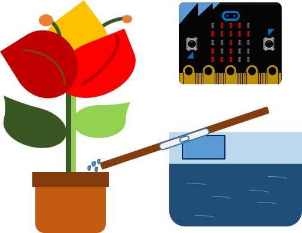

=============================
Автоматско полевање растенија
=============================

|

.. infonote::

   - Зашто се вели дека водата е извор на животот?
   - Дали сте слушнале за наводнување и одводнување?
   - Зошто им е потребна вода на растенијата?
   - Кои растенија ги имате дома и колку често ги полевате?

На растенијата им е неопходна водата за да постојат. Поради многубројните обврски, честопати ни се случува да заборавиме да ги полееме нашите куќни растенија. Од друга страна, растенијата на големите плантажи честопати зависат од врнежите дожд. 

Ќе направиме систем којшто ќе ни овозможи автоматско полевање на растенијата 
кога влажноста на почвата ќе падне под посакуваното ниво. Овој систем може да се 
применува и во домаќинствата, а воедно претставува и симулација на решавање на 
реалниот проблем со наводнувањето. 

|

**Што ни е потребно?**
	
- Два уреда Микро:бит;
- Mала пумпа за вода или сервомотор, дополнително напојување;
- NPN транзистор и отпорник 470Ω, спроводници;
- Два клинци, отпорник 10k, сад со вода.

|
	

	
|

.. ytpopup:: RrSISwO-ZNw
    :height: 432
    :width: 768
    :align: center

|

.. activecode:: zalivanje_biljke
   :passivecode: true
   :coach:
   :includesrc: src/Projekti/zalivanje_biljke.py

|

Времето кое го испланиравме за пауза до следната проверка на степенот на влажност на почвата, откако го полеавме растението, е десет секунди. Секако, почвата може да остане влажна и по неколку дена. Во нашиов случај, до следното полевање поминаа дури пет дена. Значи, бесмислено е да се проверува состојбата на секои десет секунди, бидејќи тоа ќе доведе до брзо трошење на батеријата. Времето за работење на пумпата, паузата и времето помеѓу двете отчитувања прилагодете ги согласно условите.  

Размислете за следниот проблем: избравте времето за функцијата *sleep* да биде десет часа. Дали за време на тој период ќе може да го проверите степенот на влажност?

Како и за други слични проблеми, така и за овој проблем постои решение. Се применуваат таканаречените рутини *interrupt* (за прекин), но за да се употребат потребно е малку поголемо искуство во програмирањето и тие не се опфатени во овој материјал. 

Осмислете систем за полевање на растенијата во вашиот стан. Може да управувате со еден уред *Микро:бит*, а на останатите уреди *Микро:бит* да поврзете мали пумпи или сервомотори со цевчиња. 

Направете презентација на темата *Водата е извор* на животот.

Размислете и за следниве прашања:

- Колкаво количество вода е потребно да внесе човек во текот на еден ден?
- Дали внесувате доволно течности?

Грижете се за вашето здравје! Напишете код за уредот Микро:бит кој ќе го собира количеството течности кои сте го внеле во текот на денот!