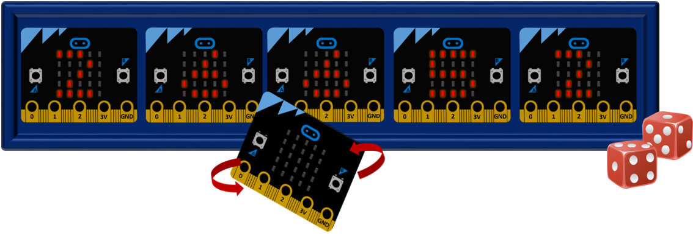

=============
Коцки за јамб
=============

|

.. infonote::

   - Наведете имиња на барем пет друштвени игри!
   - Опишете ги детално правилата на една друштвена игра!
   - Зошто се добри друштвените игри? 
   - Дали некои стари игри, кои паднале во заборав, би ви станале интересни доколку ги играте со примена на современата технологија? 

	
Кога и да се спомне современата технологија во контекст на забава, повеќето луѓе најпрво помислуваат на видеоигри. Голем број од друштвените игри што ги играле нашите родители полека паѓаат во заборав. Имаме замисла, со примена на уредот Микро:бит да ги осовремениме, а со тоа некои од нив да станат и поинтересни. Ќе направиме сет дигитални коцки за друштвената игра Јамб. 

|

**Што ни е потребно?**
	
- Шест уредот Микро:бит;
- Картонска кутија (по желба).

	
|

   
|

.. ytpopup:: JJZ_BL4DTYI
    :height: 432
    :width: 768
    :align: center

|

Кодови со кои се овозможува задржување на вредноста на коцката се следниве:

Код за коцка која ја *фрламе*:

.. activecode:: jamb_bacanje
   :passivecode: true
   :coach:
   :includesrc: src/Projekti/jamb_bacanje.py

Код за сите останати коцки:

.. activecode:: jamb_ostale_kockice
   :passivecode: true
   :coach:
   :includesrc: src/Projekti/jamb_ostale_kockice.py

- Изменете го кодот наместо цифри да покажува точки како на оригиналните коцки.
- Направете презентација со детално упатство за друштвената игра *Јамб*.
- Обидете се сами да ја нацртате табелата за оваа игра на компјутерот и, доколку сте во можност, потоа испечатете ја.
- Направете презентација на темата *Мојата омилена друштвена игра* и запознајте ги другарите со основните правила и начинот на којшто се игра играта. 
- Доколку е можно, употребете го уредот *Микро:бит* за да направите мини-уред со кој ќе ја направите играта уште поинтересна (генерирање случајни имиња кога се бираат играчи, уредот *Микро:бит* залепен за карта која кога ќе се сврти треба да покаже случајна вредност и сл.). 
- Дружете се и забавувајте се!

|