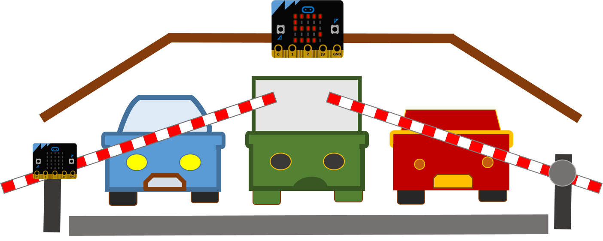

======
Гаража
======

|

Истражете и одговорете ги следниве прашања:

.. infonote::

	- Колку време просечно троши еден возач за паркирање на своето возило во период од десет дена? 
	- Дали има доволно паркинг места во вашата околина?
	- Какви видови гаражи постојат?
	- Што се подразбира под поимот паметни градови?
	- Како изгледаат современите гаражи во светските метрополи?
	

Живееме во време на четвртата индустриска револуција, во време во кое вештачката интелигенција полека навлегува во секоја пора од секојдневието и им го поедноставува на луѓето решавањето на проблемите со кои се соочуваат. 

Еден мал сегмент во кој може примената на современата технологија да ни помогне и да ни заштеди време е и гаражата со јасно истакнати слободни паркинг места. 

|

**Што ни е потребно?**
	
- Три уреди Микро:бит;
- Картон или шперплоча за изработка на макета;
- Сервомотор, дополнително напојување и спроводници (рампа - опционално).

|
	

|

Во следното видео е прикажана една од опциите за изработка на макета за паметна гаража:

|

.. ytpopup:: tbhaFnqw-IE
    :height: 432
    :width: 768
    :align: center

|

Погледнете ги уште еднаш кодовите:

Код за уредот Микро:бит на влезот од гаражата:

.. activecode:: garaza_ulaz
   :passivecode: true
   :coach:
   :includesrc: src/Projekti/garaza_ulaz.py

Код за уредот Микро:бит на излезот од гаражата:

.. activecode:: garaza_izlaz
   :passivecode: true
   :coach:
   :includesrc: src/Projekti/garaza_izlaz.py
   
Уред Микро:бит којшто собира податоци и го прикажува бројот на возила:

.. activecode:: garaza_glavni
   :passivecode: true
   :coach:
   :includesrc: src/Projekti/garaza_glavni.py
   
Размислете како може да ја направите вашата гаража уште попаметна - можеби би можело автоматски да се пали светло штом се намали видливоста, да додадете рампа на влезот и излезот, наместо со притискање копчиња влезот и излезот на возилата да се регистрира со сензор. Сигурно веќе имате идеја како да го надградите проектот! ☺

Дали имате визија што сѐ ќе биде возможно во паметните градови во иднина? Повторете си за историските збиднувања кои ја одбележаа претходната индустриска револуција! Прошетајте низ минатото, ѕирнете во иднината и направете презентација за вашите заклучоци и сознанија! 