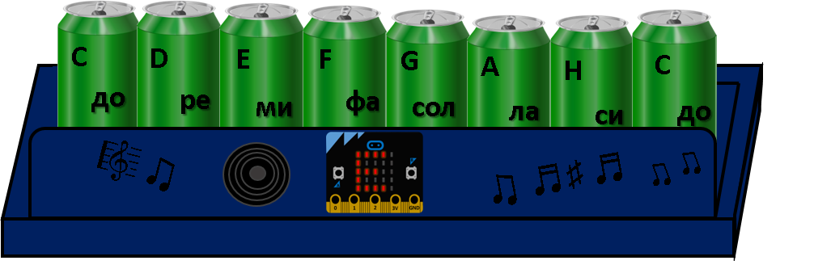

=======================
Клавијатура *Микро:бит*
=======================

|

Овој пат имаме за вас прашања од различни области:

.. infonote::

   - Какви видови инструменти постојат?
   - Што е звук, што е тон, а што нота?
   - Наведете ги имињата на тоновите (солмизација и абецеда).
   - Дали знаете што се спроводници, а што се изолатори (наведете примери)?
   - Што е рециклирање?

	
	
Осмисливме еден инструмент! Кај овој инструмент интересно е тоа што неговите клавиши може да се направат од што било! На што се сведува изборот на материјал за клавиши? 

|

**Што ни е потребно?**
	
- Четири уреди Микро:бит;
- Осум (употребени) лименки или некои други спроводни материјали;
- Спроводници (со или без крокодил-штипки);
- Звучник;
- Картонска кутија (може и од тастатурата);
- Колаж-хартија или бои за украсување на инструментот (по желба).

	
|
	

	
|

Погледнете го следното видео и потоа обидете се да направите клавијатура *Микро:бит*!

|

.. ytpopup:: OvjfijyMHwQ
    :height: 432
    :width: 768
    :align: center

|

Ги напишавме следните кодови:

Код за првиот уред *Микро:бит* (проследување на нотите C, D, E):

.. activecode:: instrument_note_cde
   :passivecode: true
   :coach:
   :includesrc: src/Projekti/instrument_note_cde.py

Код за вториот уред Микро:бит (проследување на нотите F, G, A):

.. activecode:: instrument_note_fga
   :passivecode: true
   :coach:
   :includesrc: src/Projekti/instrument_note_fga.py

Код за третиот уред Микро:бит (проследување на нотите H, C):

.. activecode:: instrument_note_hc
   :passivecode: true
   :coach:
   :includesrc: src/Projekti/instrument_note_hc.py

Код за четвртиот уред Микро:бит (прием на нотите):

.. activecode:: instrument_prijem
   :passivecode: true
   :coach:
   :includesrc: src/Projekti/instrument_prijem.py

Како и за секој друг проблем, така и за овој постојат повеќе решенија. Понекогаш потребно е малку да штедиме. На пример, замислете дека имате на располагање три уреди *Микро:бит*. Како би го решиле проблемот со нив?

Веќе напоменавме дека клавишите од клавијатурата може да се направат од различни спроводни материјали. Можеби ќе сакате да направите овошен клавир, клавир од компир или алуминиумска фолија. 

Современите клавијатури во својата меморија содржат и цели композиции. Надополнете го кодот така што со притискање на копчето А, B или двете наеднаш ќе може да ја слушнете вашата омилена мелодија! 

Нашата клавијатура е направена од рециклирани материјали – стара картонска кутија од тастатура и празни лименки. Намерата ни беше да укажеме на една исклучително важна тема – рециклирањето. 

Направете презентација на тема рециклирање и размислете како секој од нас, како поединец, може да придонесе кон зачувување на животната средина. Споделете ги вашите ставови! 

