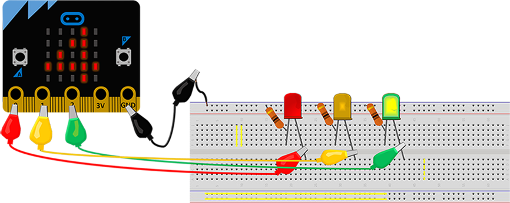

=======
Семафор
=======

|

.. infonote::

   - Што e семафор?
   - Дали знаете кога е поставен првиот семафор во светот?
   - Кога и каде е поставен првиот семафор во Македонија?
   - Дали сте забележале дека некои семафори се опремени со дополнителни уреди? Какви можности постојат?

	
Овој проект треба да укаже на фактот дека иако постојат веќе стандардизирани решенија за одредени проблеми, тие со помош на технологијата може да станат уште поефикасни и попрактични. Ќе направиме мал семафор и ќе размислиме какви можности може да понуди еден модерен семафор во прилог на безбедноста на учесниците во сообраќајот. 
|

**Шта нам је потребно?**
	
- Уред Микро:бит;
- Три светлечки диоди;
- Три отпорници од 100Ω;
- Спроводници;
- Картон или некој друг материјал за изработка на макета (по желба);
- Звучник, дополнителни уреди Микро:бит (по желба).

	
|

Во следното видео детално е прикажан начинот на поврзување на светлечките диоди и објаснет е кодот којшто ќе овозможи симулација на работење на семафор. 
	
|

.. ytpopup:: kT85LuXgOVE
    :height: 432
    :width: 768
    :align: center

|

Во следното видео детално е прикажан начинот на поврзување на светлечките диоди и објаснет е кодот којшто ќе овозможи симулација на работење на семафор. 

|

|

Основниот код може да изгледа вака:

.. activecode:: semafor
   :passivecode: true
   :coach:
   :includesrc: src/Projekti/semafor.py

Како што забележавте, дизајнот на семафорите се менува со текот на времето и сѐ почесто тие се опремени со дополнителни уреди кои придонесуваат кон безбедноста на возачите, но и на пешаците и велосипедистите во сообраќајот. Бидејќи поврзавте и напишавте код за основен модел на семафор, обидете се да направите и макета (од картон или шперплоча), која ќе ја надградите со повеќе опции. Ви ги предлагаме следниве идеи:

- Додадете светло кое трепка зелено за возилата;
- Кога ќе се притисне копчето А семафорот почнува да трепка жолто, а со притискање на копчето В семафорот се враќа во нормална состојба;
- На екранот од уредот Микро:бит може да се прикажува сигнализација за пешаците – дали е дозволено да се помине или не (✔️ или ❌);
- Додадете уште еден уред Микро:бит и поврзете го со црвена и зелена светлечка диода (сигнализација за пешаци) што преку радио ќе прима порака кога треба да се вклучат и исклучат;
- Додадете одбројување на екранот на уредот Микро:бит, за да знаат пешаците за колку секунди ќе може да ја поминат улицата;
- Поврзете звучник на вториот уред Микро:бит и кога ќе може слободно да се помине улицата тој ќе генерира звучен сигнал;
- Поврзете звучник на вториот уред Микро:бит и напишете код којшто ќе изговара дали е слободен пешачкиот премин;
- Со притискање на копчето А треба за брзо време да се овозможи слободно минување за пешаци (на прометна улица);
- Направете паметна раскрсница или синхронизирајте го работењето на повеќе семафори (зелен бран).

|

Дали имате уште некој предлог за дополнителен сензор или уред со кој би се зголемила безбедноста на раскрсниците?

За да реализирате некој од овие проекти, можеби повеќе ќе ви одговара да почнете со поинакво програмско решение за основен проект. За какво надополнување на проектот би ви бил најпогоден следниот код?

.. activecode:: semafor_alt
   :passivecode: true
   :coach:
   :includesrc: src/Projekti/semafor_alt.py

|