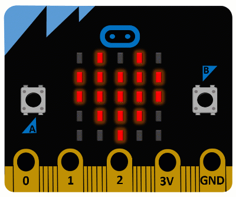

===================================
*МycroPython* за уредот *Микро:бит*
===================================

.. raw:: html

      
    

         
    Овој прирачник е изработен со поддршка од Владата на Велика Британија, во рамките на проектот „Училишта на 21-от век“ којшто го спроведува Британски совет.

     
    
 
    Прирачникот <i>„MycroPython – проектна настава“</i>
    е издаден од страна на <a xmlns:cc="http://creativecommons.org/ns#" href="https://www.britishcouncil.rs/en" property="cc:attributionName" rel="cc:attributionURL">Британски совет</a> 
    под лиценцата
    <a rel="license" href="http://creativecommons.org/licenses/by-nc-sa/4.0/">Creative Commons Attribution-NonCommercial-ShareAlike 4.0 International License</a>.
 
      
    
*МycroPython* за уредот *Микро:бит*
-----------------------------------

|

 

Овој прирачник е наменет за седмоодделенците од основните училишта и замислено е да придонесе да се реализираат часовите на кои е планирано да се изготвуваат проекти во *MicroPython* со уредот *Микро:бит*. 

Во прирачникот се посочени голем број примери во кои со помош на *Python* се управува со уредот. Сите идеи се детално објаснети, но самите кодови не се разгледуваат детално, туку се очекува учениците да имаат одредено предзнаење за програмирање со програмскиот јазик *Python*. 

Сите примери се тестирани во уредувачот *Mu (Мју)*, којшто е дизајниран на начин и почетниците во програмирањето да можат лесно да го инсталираат и користат. 

По едноставните примери на почетокот, во кои е објаснета примената на основните функции од библиотеката за работење со уредот *Микро:бит*, во прирачникот следуваат и примери за помали проекти кои може да се направат за време на часовите предвидени за проекти.

За работење со уредот *Микро:бит* и реализација на проектите предвидени се вкупно четири училишни часови, па оттаму идејата дека проектите кои ги содржи прирачникот првенствено укажуваат на разните можности кои ги нуди уредот *Микро:бит* и на неговата примена за решавање проблеми од секојдневниот живот.  

Покрај проектите, без детално упатство, дадени се и предлози за можни проширувања и надградувања, со цел да им се овозможи на заинтересираните ученици самостојно да обмислат и реализираат делови од проектите. Овие предлози се дадени и со цел да ги поттикнат учениците на креативно размислување и истражувачка работа, за да можат заедно со своите наставници да смислат нови креативни решенија. 

За учениците кои покажуваат особен интерес за програмирање, во додатокот се опишани некои можности за интерактивна работа со уредот *Микро:бит* поврзан со компјутер, кои можат да бидат навистина корисни при реализација на комплексни проекти. 

Содржина
--------

.. toctree::
	:maxdepth: 2
	
	Voved.rst
	Osnovni_funkcii.rst
	Povrzuvanje_dopolnitelni_komponenti.rst
	Razni_zadaci.rst
	Proekti/toctree.rst
	Zavrsni_zborovi.rst
	Dodatok – Prozorec REPL vo programite.rst
