==================================
Поврзување дополнителни компоненти
==================================

|

За поголемиот дел од проектите со уредот *Микро:бит* нема да биде потребна дополнителна опрема. Сепак, многу поинтересно е кога ќе видиме дека нешто се поместува, светнува или кога слушаме разни звуци. 

На уредот *Микро:бит*, покрај петте основни пинови, долж работ се наоѓаат уште дваесет помали пинови на коишто може да им пристапиме преку дополнителниот конектор (*edge connector*). Исто така, со нив може да управуваме со разни уреди и да отчитуваме податоци од многубројните сензори. Со дополнителни компоненти и напојување, може да се управува и со уреди за кои е потребна многу поголема моќност од таа што ја има самиот уред *Микро:бит*. 

За примерите кои ги разгледуваме не е потребна дополнителна опрема. Сепак, ќе претставиме неколку компоненти кои не се скапи и може лесно да се набават (во продавница за електронска опрема, преку интернет, од пријатели итн.). Со користење на овие компоненти може да ги направиме проектите уште поинтересни и да ни доближат уште повеќе колку е моќна, а истовремено и едноставна примената на програмирањето и современата технологија при решавањето проблеми од најразлични области. Замислете што сè може да се направи со уште поразновидна и подобра опрема!  

.. infonote::

	**На самиот почеток од реализацијата на примерите за проект или на кој било проект со дополнителни компоненти, направете доволно место на работната маса и однапред подгответе ги целиот потребен материјал, нацртите и шемите.** 
	
	**Пред да ја приклучите батеријата, проверете убаво за време на поврзувањето да не сте оствариле контакт што не е пожелен!**

	**Не откажувајте се доколку уредот не работи како што сте замислиле уште од првиот обид. Бидете трпеливи, сосредоточени и систематични!**

|

Светлечки диоди
---------------

Светлечката диода (*LED - Light Emitting Diode*) има две нозе (електроди) - подолга, позитивна (анода) и пократка, негативна (катода). Доколку сакате да ја вклучувате и исклучувате светлечката диода преку уредот *Микро:бит*, потребно е да ја поврзете на таков начин што пократката нога ќе се спои со GND пинот (заземјување, маса), а подолгата нога да добива позитивен напон од некој од пиновите на уредот *Микро:бит*. Доколку диодата ја поврзете преку протобордот и не може да ја утврдите должината на нејзините нозе, имајте предвид дека засечениот дел на главата од диодата се наоѓа кај пократката нога.  

Работниот напон на црвената, жолтата и зелената диода се движи помеѓу 1.8V и 2.2V (за белата и сината е и нешто повисок). На пиновите од уредот *Микро:бит* добиваме напон од 3.3V, па неопходно е на редот со диодата (од која било страна – кон GND или кон пинот со кој сакаме да управуваме) да поврземе и еден отпорник (од 100Ω), за да ја ограничиме струјата која протекува низ неа и да спречиме прегорување. Во осмо одделение се учи за струјно коло. Засега доволно е да запомните дека неопходно е да додадеме и отпорник при поврзувањето на диодата, како што е прикажано на сликата подолу.

|

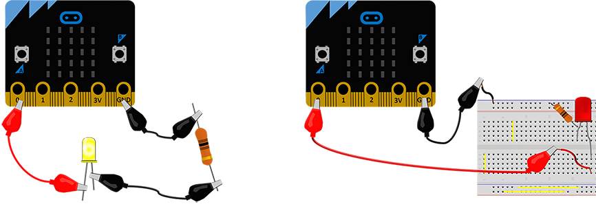

|

За нешто посложени проекти ќе ни бидат потребни многу спроводници, обични и со крокодил-штипки. Доколку сакаме да го намалиме бројот на овие спроводници, може да употребиме *протоборд*. Протобордот е плочка со дупчиња кои во внатрешниот дел се меѓусебно поврзани со метални жички и кои ни овозможуваат едноставно да го поврземе и тестираме нашето струјно коло (уред). Насоките на меѓусебно поврзаните дупчиња се обележани со жолта линија на сликата. Внимавајте да не направите кратко спојување на компонента, односно да не ја поврзете долж некоја од тие насоки.  

|

Потенциометар
-------------

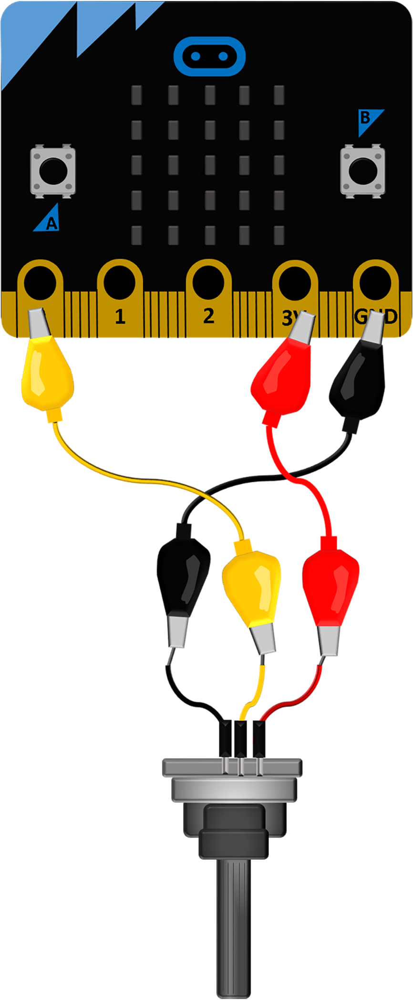
   
  
Потенциометарот е променлив отпорник којшто функционира како разделник на напонот, т.е. ни овозможува да добиеме понизок напон од дадениот. Потенциометарот може да се поврзе со уредот *Микро:бит* така што средниот контакт (нога) ќе се поврзе со еден од пиновите 0, 1 или 2 по избор, а надворешната нога на GND пинот и 3V, како што е прикажано на шемата.

Со менување на положбата на лизгачот на потенциометарот, помеѓу неговиот среден контакт и масата се добиваат разни напони од 0 до 3.3V, кои од пинот што е поврзан со средниот контакт се отчитуваат како целобројни вредности од 0 до 1023. Зависно од отчитаните вредности, кодот може да задава разни активности. 

Потенциометарот може да биде мошне корисен во проектите каде е потребно да се намалува или зголемува степенот на осветлување, да се прилагодува брзината на вртењето на моторот, да се тестира како се однесува кодот при различни отчитани вредности (ако за време на тестирањето немате сензор кој би сакале да го употребите подоцна) и за уште многу други работи.  

|

Фотоотпорник
-------------

(*Photo Resistor*)

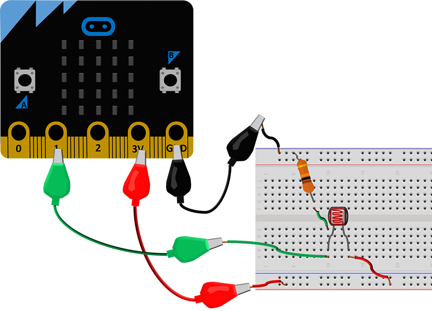

Фотоотпорникoт може да послужи како дополнителен сензор за одредување на осветленоста во просторијата, попрецизен од фотоотпорникот со кој располага уредот *Микро:бит*. Неговата отпорност е многу голема кога не е осветлен. Со зголемување на светлината отпорноста нагло му опаѓа. 

На сликата е прикажано како може да поврзете отпорник со уредот *Микро:бит* – едниот крај го врзуваме со некој од аналогните пинови на уредот *Микро:бит* (во случајов пинот 1), а другиот крај го врзуваме со пинот 3V. Потребно е помеѓу истиот пин (пин 1) и масата (GND) да ставиме и уште еден отпорник (ставивме отпорник со вредност 10k) за да добиеме напонски разделник.  

Уредот *Микро:бит* не ја отчитува промената на отпорноста на фотоотпорникот, туку промената на напонот во неговите краеви. При кодирањето, тие вредности се отчитуваат со примена на функцијата *read_analog()*, која враќа целобројни вредности од 0 до 1023.

Фотоотпорникот е одличен за проекти за штедење електрична енергија, безбедносни системи со примена на ласер и слично.

|

Еднонасочни мотори
------------------

(*DC motor*)

Ви препорачуваме да користите дополнително напојување доколку сакате да управувате со еднонасочен мотор преку уредот *Микро:бит*. Моќноста која ја добиваме на излезите на уредот *Микро:бит* не им е доволно голема за движење на повеќето мотори. Оттаму, препорачуваме со моторите да управувате со тоа што ќе ги поврзете по следнава шема:

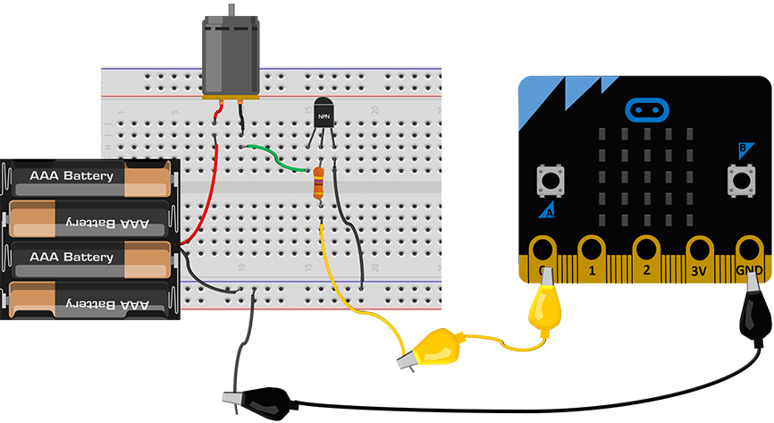

|

Еден од начините за управување со мотор преку уредот *Микро:бит* е да употребиме **транзистор** и дополнително напојување (батерија).

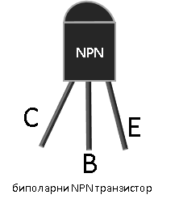

Зависно од тоа какви полуспроводници ја сочинуваат неговата структура, постојат два вида транзистор – транзистор NPN и транзистор PNP.
Ние употребивме транзистор NPN (*BC546, BC547, BC337*) кој се вклучува во колото преку три нозе (електроди): емитер (E), база (B) и колектор (C).

Основниот принцип на работа на биполарниот транзистор е со напон помеѓу двете електроди (базата и емитерот) да ја контролира струјата која протекува низ третата електрода (колекторот).

Кога на базата на транзисторот што сме го поврзале на овој начин ќе додадеме позитивен напон од излезот на уредот *Микро:бит*, низ моторот (пумпата) преку колекторот ќе протече струја. 

Постојат и други начини за управување на моторот со уредот *Микро:бит*. Тоа може да се направи и преку реле (внимавајте дека предвидено е за работа со 3.3V). Во секој случај, доколку сакате вашиот мотор да работи во две насоки, ви ја препорачуваме најсигурната опција – за таа цел да набавите дополнителна плоча *Микро:бит* за управување со мотори.  

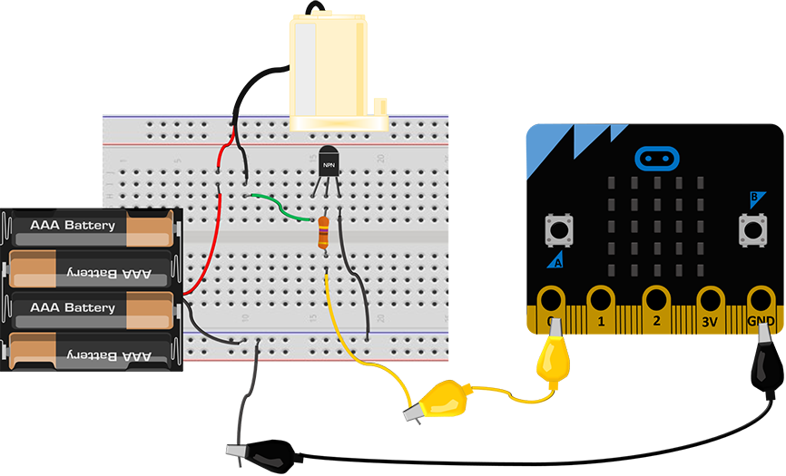

Мини пумпата за вода (*Mini Submersible Water Pump*) ја поврзуваме како и секој друг еднонасочен мотор. Оваа пумпа има одлична примена во проектите за заштита на животната средина, одгледувањето растенија, правењето чешми и украсни фонтани и слично.

|

Сервомотор
----------

(*Micro Servo Motor SG90*)

Сервомоторите се мотори кај кои може да се контролира положбата на аголот. Тие главно имаат распон од 0 до 180 степени, но некои од нив може да се постават и со распон од 360 степени.

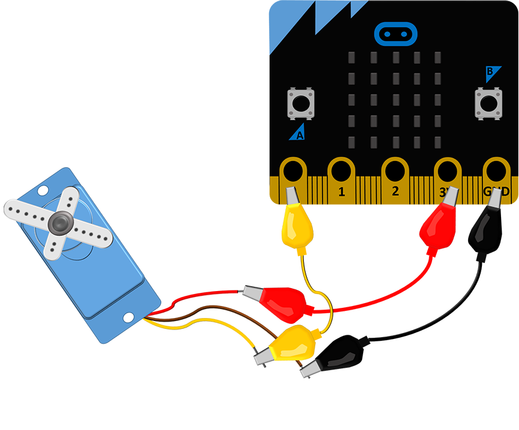

Сервомоторот го поврзуваме со три контакти (жици): црвена, кафеава и жолта. Доколку сакаме да управуваме со овој мотор преку уредот *Микро:бит*, потребно е да ја поврземе црвената жица на позитивен напон (пин 3V), кафеавата на GND, а жолтата (сигналната) ја поврзуваме на еден од пиновите 0, 1, или 2. За жал, уредот *Микро:бит* без дополнителни опрема и напојување има моќност да придвижи евентуално еден сервомотор, но и тоа е доволно да ни помогне да го разбереме начинот на којшто работи. 

Треба да се има предвид дека напонот на напојувањето на повеќето сервомотори на пазарот е од 4.8 до 6V. Иако веројатно ќе може да управувате со сервомоторот на горенаведениот начин, ве советуваме да не го напојувате директно од уредот *Микро:бит*. Доколку имате можност, поврзете го со дополнително напојување (видете ја сликата подолу). Сигналната (жолтата) жица, како и претходно ќе ја поврземе со некој од пиновите на уредот *Микро:бит*. 

|

.. infonote::

	**Секогаш кога поврзувате некоја компонента со дополнително напојување, без оглед на тоа дали се работи за сензор или извршен уред (мотор, светилка итн.), задолжително е да го поврзете GND пинот од уредот *Микро:бит* со масата (црната жица, знакот минус на батеријата) на дополнителното напојување!!!**

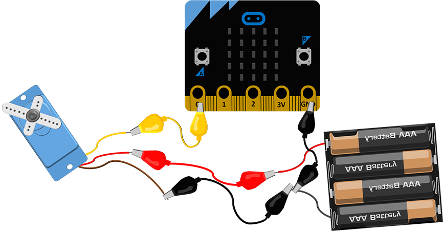

|

Звучници и слушалки
-------------------

Уредот *Микро:бит* нема вградени звучници, но многу лесно може да додадеме надворешен звучник. Ако не ви се наоѓа при рака звучник од некој постар уред или системски звучник од некој компјутер, ќе ви послужат и слушалки од мобилен телефон.

На сликата подолу е прикажано како се поврзува звучник со уредот *Микро:бит*.

|

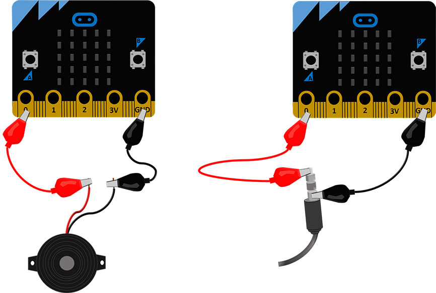

|

Црната жица од звучникот се поврзува со GND пинот од уредот *Микро:бит*, а црвената со пинот 0, преку кој ќе испратиме сигнал за генерирање звуци со различни фреквенции.

Кога се работи за слушалки, долниот дел од приклучокот (што е најблиску до пластиката) го поврзуваме со GND пинот, а врвот на приклучокот со наведениот пин. Начинот за програмирање мелодија е ист, без разлика на тоа преку што сакаме да ја слушаме. 

|

Реле
----

(*3.3V 1 Channel 3V Relay Module*)

Струјата и напонот кои ги добиваме на пиновите од уредот *Микро:бит* честопати не се доволни за управување со уреди за кои е потребна поголема моќност. Еден од начините за управување со таквите уреди е да употребиме дополнително напојување, а отворањето/затворањето на струјното коло да му го препуштиме на уредот *Микро:бит*, кој ќе го поврземе со уредот преку **реле**. 

|

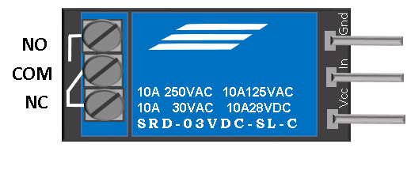

|

Реле со уредот *Микро:бит* се поврзува на следниов начин:

Од десната страна се наоѓаат три нозе: Vcc го поврзуваме на 3V од уредот Микро:бит, GND на GND од уредот *Микро:бит*, а ногата In претставува контакт за сигнал кој ќе го вклучува/исклучува излезот во зависност од вредноста која се отчитува од пинот на уредот *Микро:бит* со кој е поврзан. Значи, го поврзуваме со еден од пиновите 0, 1, или 2. 

На левата страна од извршниот уред (мотор, светилка итн.) со дополнително напојување. Средниот пин (common) е заеднички, а дали другиот крај од потрошувачот (и поврзаното дополнително напојување) ќе го поврземе со горниот или долниот пин зависи од логиката на управување која ќе ја примениме.  

NO (normally opened – нормално отворен контакт, контакт за работа) користиме кога користиме нормална логика при управувањето (кога влезниот сигнал е 1 уредот е вклучен).

NC (normally closed – нормално затворен контакт, мирен контакт) служи за управување со инверзна, обратна логика (кога е на влезот 1 треба да го исклучиме уредот, а кога е на влезот 0 уредот работи). Чест пример за примена на мирен контакт е копчето за спречување хаварија (печурка) на индустриските машини, кое кога ќе се стисне го прекинува струјното коло и машината престанува да работи.

Во продажба има и модули со 2, 4, 8 релиња, предвидени за работа со различни напони. Кога ќе набавувате реле, внимавајте да биде соодветно за работа со 3V.

|

Сензор за чад
-------------

(*MQ-2 Flammable Gas & Smoke Sensor*)

За да работи овој сензор не е доволен напон од 3.3V, па затоа го поврзавме со дополнително напојување. Покрај нозете за напојување, на сензорот се наоѓаат уште две нозе обележани со D0 и A0. Која од нив ќе ја поврземе со уредот *Микро:бит* зависи од проблематиката на којашто работиме. На задниот дел од сензорот се наоѓа потенциометар со чија помош можеме да го одредиме прагот на вредноста, односно да поставиме граница на која ќе реагира сензорот. Значи, ако користиме нога D0 (D - дигитална вредност), уредот *Микро:бит* ќе ја отчита дигиталната вредност 0 (ако отчитал вредност која е помала од онаа која сме ја наместиле со потенциометарот) или 1 (ако таа вредност е поголема). Ногата А0 (А - аналогна вредност) ќе ја поврземе ако ни е потребно за апликацијата да го следиме менувањето на вредностите што ги отчитал сензорот, кои може да имаат распон од 0 до 1023.
 
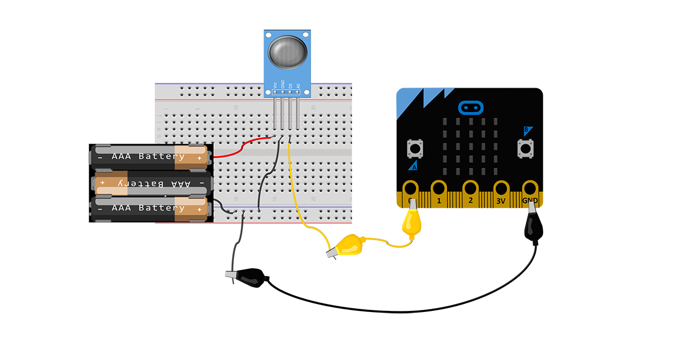

Освен на чад во просторија, овој сензор реагира и на алкохол, бутан, пропан, водород, што сигурно ќе ве инспирира за разни проекти.

|

Сензор за движење
-----------------

(*HC-SR501 Infrared PIR*)

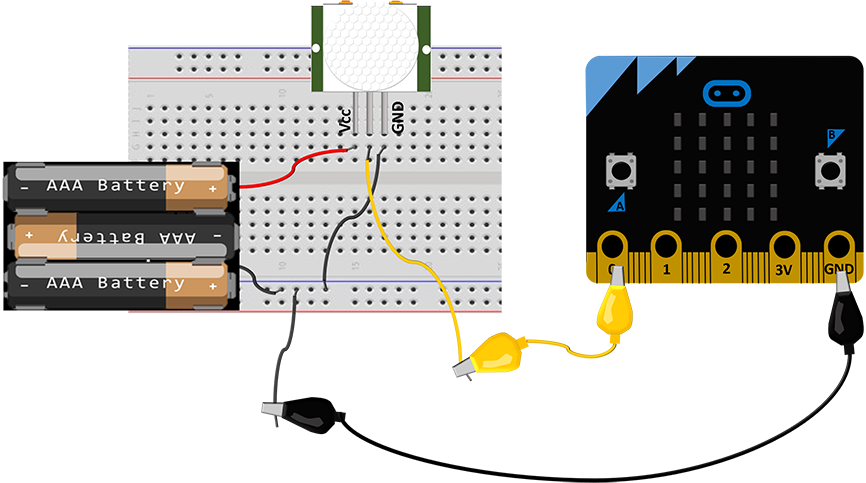

|

Како и за сензорот за чад, за сензорот за движење (сензорот PIR (*Passive Infrared*)) е потребно напојување со повисок напон (5V). Овој сензор има три нозе. GND и Vcc ги поврзувате со батеријата (ако користите дополнителен конектор, поврзете ги уредот *Микро:бит* на GND и пинот со 5V), а средната нога поврзете ја со некој од аналогните пинови 0, 1 или 2 на уредот *Микро:бит*.

Како работи овој сензор? Тој се состои од два дела кои ја регистрираат јачината на инфрацрвеното зрачење. Имено, сите предмети и суштества емитуваат инфрацрвено зрачење со одредена јачина. Топлите предмети зрачат посилно, а студените послабо. Сензорот, споредувајќи отчитувањата од своите два дела всушност ја детектира разликата во зрачењето. Кога се движи тело во близина на сензорот, кај овие две отчитувања нема да настапи иста промена. Кога едниот дел регистрира повеќе или помалку зрачење од другиот, тогаш се активира излез.  

На задниот дел од овој сензор се наоѓаат два потенциометри со чија помош можеме да ја прилагодиме чувствителноста на сензорот (*Sensitivity*, до која далечина да реагира) и колку долго сензорот ќе го задржи излезот на високо ниво кога ќе детектира движење (*Delay time*). Во некои случаи може да се детектира и движење на оддалеченост од седум метри.

**Напомена:** 

- На почетокот кога ќе се вклучи сензорот, потребно е да го оставиме некое време (барем 30 секунди), за да ја измери референтната вредност на инфрацрвеното зрачење во просторијата. Потоа, ќе може да го користиме.
- Постои и можност сензорот да се напојува директно со 3.3V, но за таа постапка потребно е лемење, па затоа како поедноставно решение предложивме да се користи дополнително напојување.

|

Ултразвучен сензор
------------------

(*HC-SR04*)

Најпрво да објасниме што е звук, а што ултразвук. Брановите преку воздухот се простираат со осцилирање на воздушните честички. Таквите осцилации се пренесуваат и во мембраната во нашето уво. Кога фреквенцијата на ваквото осцилирање е во одреден опсег (до 20 KHz), тогаш осцилирањето го доживуваме како звук, т.е. го слушаме. Брановите ги нарекуваме ултразвук, односно осцилации кои имаат премногу висока фреквенција за да можеме да ги слушнеме. Оттаму, звучните и ултразвучните бранови по природа се исти, а се разликуваат единствено по тоа како ги доживуваме (едните можеме да ги слушнеме, а другите не). 

Ултразвучниот сензор емитува бранови со високи фреквенции (ултразвучни бранови), кои ако пред сензорот стои препрека се одбиваат и враќаат кон него. Времето кое е потребно да се регистрира повратен сигнал е пропорционално на растојанието од сензорот до препреката.  

Овој сензор работи на 5V. Ако користите конектор за уредот *Микро:бит*, на него ќе забележите пин кој го обезбедува овој напон. Како алтернатива, за ова ќе ви послужат и три батерии од по 1.5V.

На ултразвучниот сензор постојат четири пинови: Vcc, Trig, Echo и GND. Пиновите Vcc и GND се поврзуваат на таков начин што сензорот го добива потребниот напон (при тоа GND пинот треба да се поврзе и со контактот GND на уредот *Микро:бит*, како на сликата). Пиновите Trig и Echo може да ги поврзете и по желба на кој било пин на уредот *Микро:бит* (0, 1 или 2), со тоа што истите пинови треба да ги употребите и во кодот. Иако на повеќето примери на интернет пинот Echo директно е поврзан со уредот *Микро:бит*, ви препорачуваме со употреба на два отпорника да го намалите напонот на повратниот сигнал, како што е прикажано на шемата (отпорниците не можат да имаат исти вредности како нашите, но меѓусебниот однос на нивните вредности треба да е приближно ист како на сликата). 

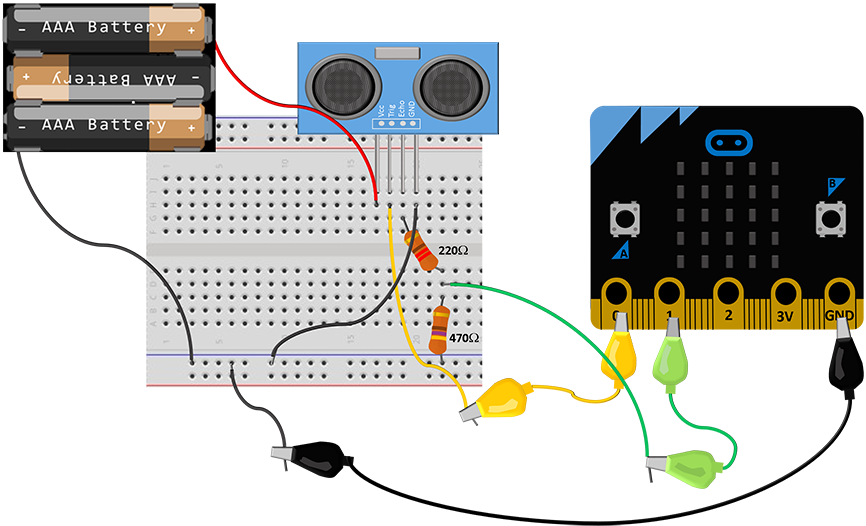

|

Сензор за детекција на вода/капки дожд
--------------------------------------

(*Raindrop Detection Sensor*)

|

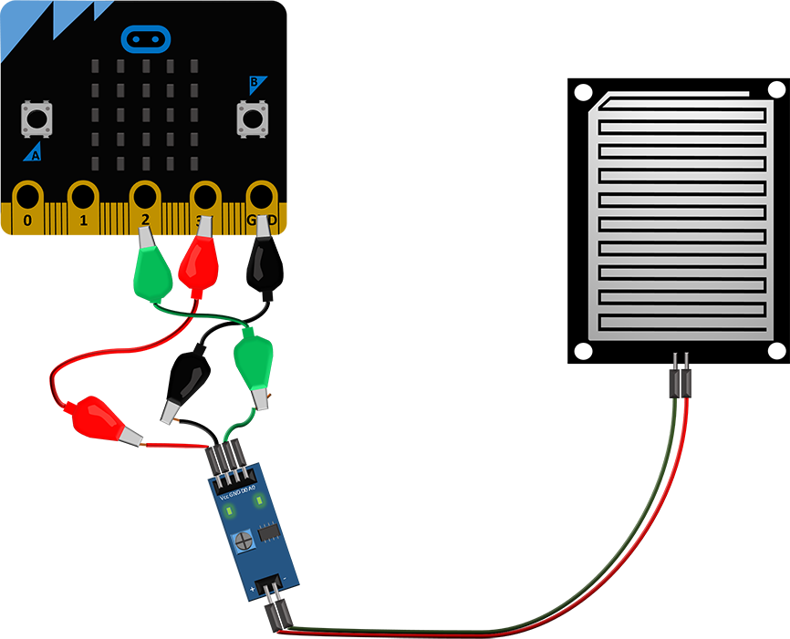

Овој сензор е предвидено да работи со напон од 3.3V до 5V, па затоа во примерите со истиот не користевме дополнителна батерија. Податоците од овој сензор се отчитуваат навистина едноставно. Тој се користи заедно со контролната плочка која ви овозможува да ги следите аналогните и дигиталните вредности, зависно од начинот на употреба. 

На контролната плочка се наоаѓаат две светлечки диоди – едната сигнализира дека сензорот е под напон, а другата се вклучува кога сензорот ќе детектира вода, односно капки дожд. Која вредност ќе ја вклучи светлечката диода, односно на која вредност ќе изреагира излезот на сензорот, зависи од поставените вредности кои сме ги избрале со движење на потенциометарот, кој исто така се наоѓа на оваа плочка. 

Овој сензор работи со обратна логика, па кога ќе детектира присуство на вода на излезот дава логичка нула, а во спротивно ја дава вредноста 1. 
  
Сензорот се поврзува со уредот *Микро:бит* на едноставен начин. Пинот Vcc со поврзуваме со 3V на уредот Микро:бит, GND го спојуваме со GND на уредот Микро:бит, а зависно од тоа дали сакаме да го следиме нивото/количината на течност (аналогна вредност) или да детектираме дали има/нема вода (дигитална вредност), на некој од пиновите 0, 1 или 2 ќе поврземе А0 (аналоген) или D0 (дигитален) пин на сензорот.

Примената е разновидна – од следење на временските услови, одржување на нивото на течност, до разни безбедносни системи (течење вода од цевка и слично).

|

Проверете го вашето знаење
..........................

|

**Прашање 1: Малиот рез (отсечениот дел) на главата на диодата се наоѓа на страната:**

.. mchoice:: q3_1
    :answer_a:	каде што кратките пинови се врзуваат со GND на уредот *Микро:бит*.
    :answer_b:	не значи ништо, тој е фабричка грешка.
    :answer_c:	каде што подолгите пинови се врзуваат со GND на уредот *Микро:бит*. 
    :answer_d:	каде што подолгите пинови се врзуваат на 3V уредот *Микро:бит*. 
    :correct: a
    :feedback_a: 14.	Така е, малиот рез се наоѓа над пократката нога, која претставува негативен крај на диодата и се поврзува со GND пинот на уредот *Микро:бит*. 
    :feedback_b: Одговорот не е точен, обидете се повторно!
    :feedback_c: Одговорот не е точен, обидете се повторно!
    :feedback_d: Одговорот не е точен, обидете се повторно!

|

**Прашање 2: Ако покрај диодата не поврземе во редови и соодветен отпорник, ...**

.. mchoice:: q3_2
    :answer_a:	... диодата нема да свети.
    :answer_b:	... диодата може да прегори.
    :answer_c:	... диодата ќе треба обратно да се поврзе.
    :answer_d:	... диода ќе свети послабо.
    :correct: b
    :feedback_a: Одговорот не е точен, обидете се повторно!
    :feedback_b: 15.	Така е, редно поврзаниот отпорник ќе ја намали јачината на струјата низ светлечката диода.
    :feedback_c: Одговорот не е точен, обидете се повторно!
    :feedback_d: Одговорот не е точен, обидете се повторно!

|

**Прашање 3: За да се управува со сервомотор, потребно е да се поврзат:**

.. mchoice:: q3_3
    :answer_a:	4 жици (проводници)
    :answer_b:	3 жици (проводници)
    :answer_c:	2 жици (проводници)
    :answer_d:	1 жица (проводник)
    :correct: b
    :feedback_a: Одговорот не е точен, обидете се повторно!
    :feedback_b: 16.	Сервомоторот треба да има три жици, кафеава, црвена и жолта жица, кои ќе ги поврземе со напојувањето и некои пинови за да може да управуваме со него. 
    :feedback_c: Одговорот не е точен, обидете се повторно!
    :feedback_d: Одговорот не е точен, обидете се повторно!

|

**Прашање 4: Кога го поврзуваме сервомоторот со уредот Микро:бит, жолтата жица од сервомоторот ја поврзуваме:**

.. mchoice:: q3_4
    :answer_a:	со некој од пиновите 0, 1, 2.
    :answer_b:	со 3V.
    :answer_c:	со GND.
    :answer_d:	исклучиво преку дополнителен конектор на некој од помалите пинови.
    :correct: a
    :feedback_a: Одговорот е точен, жолтата жица е сигнална и се поврзува со пиновите 0, 1 или 2 (доколку немаме дополнителен конектор за да пристапиме до останатите пинови). 
    :feedback_b: Одговорот не е точен, обидете се повторно!
    :feedback_c: Одговорот не е точен, обидете се повторно!
    :feedback_d: Одговорот не е точен, обидете се повторно!

|

**Прашање 5: Дали може уредот *Микро:бит* да управува со три сервомотори?**

.. mchoice:: q3_5
    :answer_a:	Може, без никаков проблем!
    :answer_b:	Не може да се поврзат толку мотори на уредот *Микро:бит*.
    :answer_c:	Може, но не без дополнително напојување или дополнителна компонента бидејќи уредот *Микро:бит* нема доволна моќност.  
    :answer_d:	Физички е возможно, но не постои програмско решение.  
    :correct: c
    :feedback_a: Одговорот не е точен, обидете се повторно!
    :feedback_b: Одговорот не е точен, обидете се повторно!
    :feedback_c: 18.	Така е, постојат повеќе начини на кои може да се изведе ова, но не без дополнителни компоненти и дополнително напојување. 
    :feedback_d: Одговорот не е точен, обидете се повторно!

|

**Прашање 6: Доколку сакаме да слушнеме мелодија од уредот Микро:бит, делот од конекторот од слушалките или некој звучник кој е најблиску до пластиката го поврзуваме со:**

.. mchoice:: q3_6
    :answer_a: GND пинот на уредот *Микро:бит*.
    :answer_b:	кој било од пиновите.
    :answer_c:	со 3V.
    :answer_d:	Не може да се слушне звук од уредот *Микро:бит*.
    :correct: a
    :feedback_a: Одговорот е точен! 
    :feedback_b: Одговорот не е точен, обидете се повторно!
    :feedback_c: Одговорот не е точен, обидете се повторно!
    :feedback_d: Одговорот не е точен, обидете се повторно!

