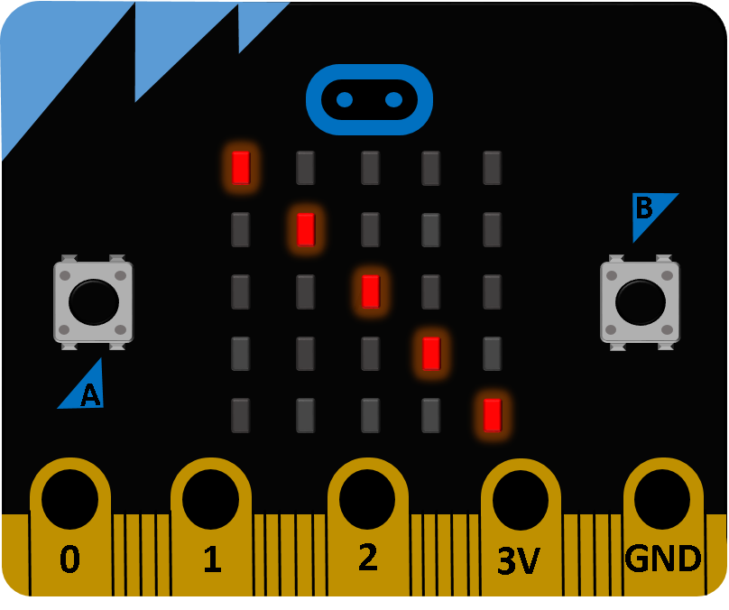
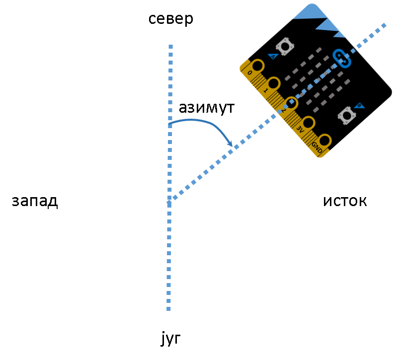
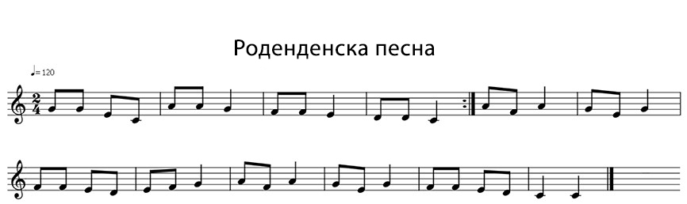

============
Разни задачи
============
|

Секој проблем секогаш може да се реши на повеќе начини. Ова поглавје е наменето, со помош на уште неколку примери, самостојно да вежбате програмирање со уредот *Микро:бит*. Секоја задача обидете се прво да ја решите самите, па дури потоа споредете го вашето решение со нашиот предлог. 

Додека се обидувате да најдете решение, слободно служете се со решените примери кои се достапни во претходните поглавја.

|

**Задача 1:**

.. questionnote::

	**Напишете код со којшто ќе се вклучува диодата на главната дијагонала од екранот на уредот Микро:бит.**

|

|

Главната дијагонала претставува линија што ги поврзува долниот лев агол и долниот десен агол на екранот. Оваа задача ќе ја решиме на два начина.

Првото решение е за секоја диода да користиме функција којашто ќе ја вклучи. Обидете се! 

.. reveal:: Задатак1a
	:showtitle: Прво решение:
	:hidetitle: Cкриј решение
	
	Едно од можните решенија е следново: 
	
	.. activecode:: dijagonala
		:passivecode: true
		:coach:
		:includesrc: src/RazniZadaci/dijagonala.py

Можеме да заклучиме дека за диодите кои се наоѓаат на главната дијагонала бројот на редови и колони е ист. Имајќи го овој факт предвид, обидете се да составите решение во кое ќе ја примените јамката *for*.

.. reveal:: Задатак1b
	:showtitle: Второ решение:
	:hidetitle: Cкриј решение
	
	.. activecode:: dijagonala_2
		:passivecode: true
		:coach:
		:includesrc: src/RazniZadaci/dijagonala_2.py

- Овие два кода не се разликуваат многу во должината, со оглед на тоа дека вклучуваме само пет диоди. Колку линии код би ни биле потребни за 10 000 диоди, сместени во 100 редови и 100 колони за првото решение, а колку за второто? 
- Споредната дијагонала на екранот ги поврзува долниот лев агол и горниот десен агол. Во каков сооднос се редовите и колоните кои се наоѓаат на оваа дијагонала? Обидете се да составите код со којшто ќе се вклучуваат диодите кои се наоѓаат на споредната дијагонала. 

|

**Задача 2:**

.. questionnote::

	**Напишете код којшто со паузи од половина секунда ќе вклучува една по една диода на екранот по колони, почнувајќи од горните диоди од првата колона.**
	
.. reveal:: Задатак2
	:showtitle: Спореди го решението:
	:hidetitle: Cкриј решение

	Едно од можните решенија е следново: 

	.. activecode:: jedna_po_jedna_dioda
		:passivecode: true
		:coach:
		:includesrc: src/RazniZadaci/jedna_po_jedna_dioda.py

	Дали ја увидовте предноста на применување циклуси во кодот? 

- Што би требало да смениме во кодот за да се вклучуваат диодите една по една во редовите? 
- Што ќе се случи доколку линијата код sleep(500) ја поместиме за еден таб налево?

|

**Задача 3:**

.. questionnote::

	**Ѕвезда – Напишете код којшто постепено ќе ја зголемува осветленоста на диодата која се наоѓа на средината од екранот (во третиот ред и третата колона), а потоа ќе ја намалува осветленоста од 0 до 9.**
	
.. reveal:: Задатак3a
    :showtitle: Прво решение
    :hidetitle: Cкриј решение

	Едно од можните решенија е следново: 

	.. activecode:: zvezda
		:passivecode: true
		:coach:
		:includesrc: src/RazniZadaci/zvezda.py
		
Параметрите на функцијата *display.set_pixel(x, y, osvetlenost)* кои ги користевме се: **x** – реден број на колоната кој може да има вредност од 0 до 4, **y** - реден број на редот кој исто може да има вредност од 0 до 4, а осветленоста може да биде од 0 до 9.

Секој проблем може да се реши на повеќе начини! Обидете се да го решите овој проблем без да ја примените јамката *for*!

.. reveal:: Задатак3б
    :showtitle: Второ решение
    :hidetitle: Cкриј решение

	Едно од можните решенија е следново: 

	.. activecode:: zvezda_2
		:passivecode: true
		:coach:
		:includesrc: src/RazniZadaci/zvezda_2.py

|

**Задача 4:**

.. questionnote::

	**Напишете код којшто ќе овозможи да свети диодата која се наоѓа најсеверно.**
	
Да се потсетиме, функцијата *compass.heading()* враќа азимут.  

.. reveal:: Задатак4
	:showtitle: Споредете го решението!
	:hidetitle: Cкриј решение
	
	Едно од можните решенија е следново: 

	.. activecode:: pokazi_sever
		:passivecode: true
		:coach:
		:includesrc: src/RazniZadaci/pokazi_sever.py

Надополнете го кодот за да биде попрецизен, да вклучува дополнителни диоди во аглите на екранот кои би покажувале североисток, југозапад итн. (дополнително поделете ги интервалите на азимутот за кои ги дефиниравме страните на светот). 

|

**Задача 5:**

.. questionnote::

	**Напишете код за "Роденденска песна".**
	
Нотите за оваа песна се:

.. reveal:: Задатак5
	:showtitle: Споредете го решението!
	:hidetitle: Cкриј решение
	
	Едно од можните решенија е следново: 

	.. activecode:: danas_nam_je_divan_dan
		:passivecode: true
		:coach:
		:includesrc: src/RazniZadaci/danas_nam_je_dvan_dan.py

Секако, може да наведеме и целосна листа на сите ноти, но со воочување на деловите од мелодијата кои се повторуваат ја скративме должината на кодот.  

|
	
**Задача 6:**

.. questionnote::

	**Напишете код којшто на екранот ќе ја испишува вредноста на температурата во Целзиусови степени кога ќе се притисне копчето А, во Фаренхајтови степени кога ќе се притисне копчето B, а во Келвини кога ќе се притиснат двете копчиња наеднаш.**

Формулата со која ја пресметуваме вредноста на температурата во Фаренхајтови степени е: **F = 1.8*C + 32**

Формулата со која ја пресметуваме вредноста на температурата во Келвини е: **К = C + 273.15**, где је **C** при што C е температурата во Целзиусови степени која ја отчитува уредот *Микро:бит*.

.. reveal:: Задатак6
	:showtitle: Споредете го решението!
	:hidetitle: Cкриј решение
	
	Едно од можните решенија е следново: 
	
	.. activecode:: temperatura_c_f_k
		:passivecode: true
		:coach:
		:includesrc: src/RazniZadaci/temperatura_c_f_k.py

|

**Задача 7:**

.. questionnote::	

	**Сигнализација за премин преку железничка пруга – Напишете код којшто ќе овозможи наизменично да се вклучуваат/исклучуваат двете светлечки диоди поврзани со пиновите на уредот Микро:бит.**
	
.. reveal:: Задатак7
	:showtitle: Споредете го решението!
	:hidetitle: Cкриј решение
	
	Кодот е сличен на решението за Пример 16 од поглавјето Основни функции: 

	.. activecode:: pruzni_prelaz
		:passivecode: true
		:coach:
		:includesrc: src/RazniZadaci/pruzni_prelaz.py
		
|

**Задача 8:**

.. questionnote::	

	**Напишете код којшто ќе овозможи со притискање на копчето А безжично да се вклучи, односно со притискање на копчето B безжично да се исклучи диода поврзана на друг уред Микро:бит.**
	
.. reveal:: Задатак8
	:showtitle: Споредете го решението!
	:hidetitle: Cкриј решение
	
	Ќе составиме два кода – првиот ќе го вчитаме во уредот Микро:бит кој управува со диодата, а вториот во уредот Микро:бит со кој е поврзана диодата.

	Кодот за првиот уред Микро:бит ќе ни овозможи преку радио да проследиме сигнал 0 или 1, зависно од тоа кое копче ќе го притиснеме:

	.. activecode:: radio_veza_slanje
		:passivecode: true
		:coach:
		:includesrc: src/RazniZadaci/radio_veza_slanje.py
				
	Другиот уред Микро:бит ја прима оваа вредност и ни овозможува да ја вклучиме/исклучиме диодата која е поврзана со пинот 1:
	
	.. activecode:: radio_veza_prijem
		:passivecode: true
		:coach:
		:includesrc: src/RazniZadaci/radio_veza_prijem.py

|

**Задача 9:**

.. questionnote::	

	**Напишете код којшто симулира "трчачко светло". На пиновите 0, 1 и 2 треба да се поврзат светлечки диоди коишто редоследно во линија, наизменично ќе се вклучуваат и исклучуваат.**

.. reveal:: Задатак9a
	:showtitle: Споредете го решението!
	:hidetitle: Cкриј решение
	
	Едно од можните решенија е следново: 
	
	.. activecode:: trcece_svetlo
		:passivecode: true
		:coach:
		:includesrc: src/RazniZadaci/trcece_svetlo.py
	
Замислете дека се работи за некој друг контролер и дека треба да се вклучат и исклучат петнаесет светлечки диоди. Колку линии би имал кодот? Можеме да извлечеме заклучок дека нашето прво решение би можело да биде поелегантно, иако и вака е функционално. За да биде кодот пократок и попрегледен, можеме пиновите со коишто управуваме да ги сместиме во терка, а тоа што треба да го сториме со секој од нив е да го ставиме во циклусот *for*. 

.. reveal:: Задатак9b
	:showtitle: Споредете го решението!
	:hidetitle: Cкриј решение

	Погледнете го и тестирајте го и вториот предлог.
	
	.. activecode:: trcece_svetlo_2
		:passivecode: true
		:coach:
		:includesrc: src/RazniZadaci/trcece_svetlo_2.py

|

**Задача 10:**

.. questionnote::	

	**Напишете код за симулатор за коцка за играта Не лути се, човеку!, којшто кога ќе се протресе уредот Микро:бит ќе прикажува одреден број точки распоредени како на вистинска коцка.**
	
.. reveal:: Задатак10
	:showtitle: Споредете го решението!
	:hidetitle: Cкриј решение
	
	Прво ќе ги дефинираме сликите кои ќе се прикажуваат наместо броеви, а потоа ќе ги поврземе со случајната вредност генерирана од уредот Микро:бит:

	.. activecode:: kockica_tackice
		:passivecode: true
		:coach:
		:includesrc: src/RazniZadaci/kockica_tackice.py
		
|

**Задача 11:**

.. questionnote::	

	**Напишете код за алармен систем. Системот се вклучува со копчето A, а се исклучува со копчето B. Кога уредот Микро:бит се поместува во однос на x-оската додека е вклучен системот, алармот се активира и почнува да свири сирената. Сирената треба да свири сè додека не се исклучи системот со притискање на копчето B.**
	
.. reveal:: Задатак11
	:showtitle: Споредете го решението!
	:hidetitle: Cкриј решение
	
	Ако за граница за поместување која треба да активира аларм ја земеме вредноста 100, кодот ќе изгледа вака:
	
	.. activecode:: alarm
		:passivecode: true
		:coach:
		:includesrc: src/RazniZadaci/alarm.py
		
|

**Задача 12:**

.. questionnote::	

	**Напишете код којшто на Plotter врши отчитување на температура надвор од просторијата со уредот Микро:бит. Доколку надворешната температура е под 20 степени, на уредот Микро:бит којшто се наоѓа во просторијата ќе се испише „studeno“.**
	
.. reveal:: Задатак12
	:showtitle: Споредете го решението!
	:hidetitle: Cкриј решение
	
	Веќе имавме сличен пример во претходното поглавје. Разликата е во тоа што овој пат ги отчитуваме податоците од другиот уред *Микро:бит*. Код за уредот *Микро:бит* кој се наоѓа надвор од просторијата (испраќа податоци за температурата): 

	.. activecode:: temperatura_napolju_a
		:passivecode: true
		:coach:
		:includesrc: src/RazniZadaci/temperatura_napolju_a.py

	Код за уредот *Микро:бит* кој се наоѓа во просторијата (прима податоци за температурата и испишува порака): 

	.. activecode:: temperatura_napolju_b
		:passivecode: true
		:coach:
		:includesrc: src/RazniZadaci/temperatura_napolju_b.py
	
|
	
**Задача 13:**

.. questionnote::	

	**Напишете код којшто ќе управува со екранот така што секоја секунда наизменично ќе се вклучуваат диодите од првите две колони и последните две колони.**
	
.. reveal:: Задатак13
	:showtitle: Споредете го решението!
	:hidetitle: Cкриј решение
	

	Едно од можните решенија е следново: 

	.. activecode:: kolone_naizmenicno
		:passivecode: true
		:coach:
		:includesrc: src/RazniZadaci/kolone_naizmenicno.py

Што би требало да се смени за да се вклучуваат и исклучуваат диодите по редови наместо по колони?

|
	
**Задача 14:**

.. questionnote::	

	**Напишете код којшто со помош на копчињата А и B ќе управува со сервомотор. Замислете дека на моторот е поврзана пумпа. Со притискање на копчето А треба да ја кренеме рампата, а со притискање на копчето В да ја спуштиме.**
	
.. reveal:: Задатак14
	:showtitle: Споредете го решението!
	:hidetitle: Cкриј решение
	
	Едно од можните решенија е следново (вредностите за крајните положби на рампата одредете ги сами експериментално): 

	.. activecode:: servo_rampa
		:passivecode: true
		:coach:
		:includesrc: src/RazniZadaci/servo_rampa.py

|

**Задача 15:**

.. questionnote::	

	**Напишете код којшто ќе овозможи со вртење на потенциометарот да управуваме со брзината на трепкање на срцето коешто е прикажано на екранот.**
	
Брзината на трепкање на срцето ќе ја прилагодуваме со тоа што ќе ја зголемуваме и намалуваме должината на паузата помеѓу двете прикажувања на иконата. Потенциометарот поврзете го со пинот 0, како што е објаснето во поглавјето *Дополнителни компоненти*. 
	
.. reveal:: Задатак15
	:showtitle: Споредете го решението!
	:hidetitle: Cкриј решение
	
	Со вртење на потенциометарот отчитуваме вредност од 0 до 1023 на пинот со којшто е поврзан (ова може да го проверите со тоа што ќе напишете код кој ќе ја испишува на екранот вредноста на пинот), па оттаму таа вредност може да ја употребиме за дефинирање на должината на паузата (ќе додадеме 50 за да не ни биде паузата нула кога потенциометарот е во долна положба).  

	.. activecode:: brzina_srca
		:passivecode: true
		:coach:
		:includesrc: src/RazniZadaci/brzina_srca.py

Можеме да извлечеме заклучок дека паузата ќе биде најкратка во почетната положба на потенциометарот, па тогаш срцето ќе трепка најбрзо. Што треба да смените за да трепка срцето најбавно во почетната положба на потенциометарот (размислете како би го смениле кодот, но во поглед на начинот на поврзување)? 

|

**Задача 16:**

.. questionnote::	

	**Напишете код којшто ќе овозможи со вртење на потенциометарот да се вклучува еден по еден ред, почнувајќи од најдолниот ред. Диодите треба да светат со интензитет 5.**

Поврзете го потенциометарот со пинот 0 како што е објаснето во поглавјето *Дополнителни компоненти* (може и со некој од другите пинови, но важно е и во кодот да се отчитани податоците од истиот пин).
	
Во претходната задача веќе спомнавме дека на пинот којшто е поврзан со потенциометарот, зависно од положбата на потенциометарот, отчитуваме вредности од 0 до 1023. Еден од начините да ја решиме задачата е во рамките на интервалот (0, 1023) за секој ред од екранот да одредиме гранично ниво, така што за вредностите над граничното ниво ќе се вклучуваат диодите од тој ред на екранот. Граничните нивоа за редовите треба да бидат што порамномерно распоредени. На пример, за најгорниот ред 900, за вториот ред 700, за средниот ред 500, за четвртиот ред 300 и за најдолниот ред 100.
	
.. reveal:: Задатак16
	:showtitle: Споредете го решението!
	:hidetitle: Cкриј решение
	
	Програмско решење може изгледати овако

	.. activecode:: dodavanje_vrsta
		:passivecode: true
		:coach:
		:includesrc: src/RazniZadaci/dodavanje_vrsta.py

Наместо да ги одредуваме граничните нивоа за редовите, можевме и да го пресметаме бројот на редови на екранот кои сакаме да светат (на пример, со делење на отчитаната вредност на соодветно избраниот број). Потоа, за двојната јамка вклучуваме онолку редови од долниот дел на екранот колку што е потребно.  

.. reveal:: Задатак16_2
	:showtitle: Споредете го решението!
	:hidetitle: Cкриј решение
	
	Програмско решење може изгледати овако

	.. activecode:: dodavanje_vrsta_2
		:passivecode: true
		:coach:
		:includesrc: src/RazniZadaci/dodavanje_vrsta_2.py

Секако ова се само некои од можните решенија. Обидете се да го решите проблемот и на некој друг начин.

Како би изгледал еден код кој треба да вклучи само по еден ред кој (фигуративно) ќе се крева и спушта зависно од положбата на потенциометарот?

|
	
**Задача 17:**

.. questionnote::	

	**Напишете код којшто ќе овозможи на екранот да се прикажува бројот на допрениот пин.**
	
.. reveal:: Задатак16a
	:showtitle: Прво решење
	:hidetitle: Cкриј решение
	
	Едно од можните решенија е следново: 

	.. activecode:: dodirnuti_pin
		:passivecode: true
		:coach:
		:includesrc: src/RazniZadaci/dodirnuti_pin.py

Размислете дали можеме малку поинаку да го напишеме кодот...
	
.. reveal:: Задатак16b
	:showtitle: Друго решење
	:hidetitle: Cкриј решение	
	
	Едно од решенијата е да се примени терка и циклус во кодот: 
	
	.. activecode:: dodirnuti_pin_2
		:passivecode: true
		:coach:
		:includesrc: src/RazniZadaci/dodirnuti_pin_2.py

Да се потсетиме, под допрен пин се подразбира дека со другата рака сме поврзани со GND преку спроводник!

|

**Задача 18:**

.. questionnote::	

	**Напишете код којшто ќе овозможи управување со мотор или пумпа за вода. Кога ќе се притисне копчето А треба да се вклучи моторот, а кога ќе се притисне копчето B треба да се исклучи моторот.**
	
Моторот, односно пумпата, поврзете го/ја како што е опишано во поглавјето *Дополнителни компоненти*. Го/ја вклучуваме и исклучуваме со впишување на дигиталната вредност 1, односно 0, на доделениот пин.
	
.. reveal:: Задатак18
	:showtitle: Споредете го решението!
	:hidetitle: Cкриј решение
	
	.. activecode:: kontrola_motora
		:passivecode: true
		:coach:
		:includesrc: src/RazniZadaci/kontrola_motora.py

|

**Задача 19:**

.. questionnote::	

	**Напишете код којшто ќе овозможи од уредот Микро:бит да се слушне пораката Добар ден! кога ќе се притисне копчето А и Довидување! кога ќе се притисне копчето B.**
	
За да слушнеме говор од уредот *Микро:бит*, потребно е да направиме две нешта: да поврземе звучник или слушалки на пинот 0 (прочитајте го поглавјето Дополнителни компоненти) и на самиот почеток да ја вклучиме библиотеката speech, за да можеме да ја користиме функцијата за репродуцирање говор. 
	
.. reveal:: Задатак19
	:showtitle: Споредете го решението!
	:hidetitle: Cкриј решение
	
	Решението за овој проблем е многу едноставно!

	.. activecode:: govor
		:passivecode: true
		:coach:
		:includesrc: src/RazniZadaci/govor.py

Иако уредот нема јасно и правилно да го изговара секој збор, изговорениот текст ќе биде разбирлив во голема мера и оваа можност веројатно со задоволство ќе сакате да ја користите во проектите на кои ќе работите.

|

**Задача 20:**

.. questionnote::	

	**Напишете код којшто ќе го детектира нивото на осветленост во просторијата со примена на дополнителен фотоотпорник поврзан со пинот 0. Кога степенот на осветленост е поголем од 400, на екранот треба да пишува den, а спротивно од тоа nokj и да се вклучи диодата поврзана со пинот 1.**
	
Диодата и фотоотпорникот ќе ги поврземе со соодветните пинови, како што е објаснето во поглавјето *Дополнителни компоненти*. 
	
.. reveal:: Задатак20
	:showtitle: Споредете го решението!
	:hidetitle: Cкриј решение
	
	Решението за овој проблем е многу слично на примерите кои веќе ги сработивме. 

	.. activecode:: foto_otpornik
		:passivecode: true
		:coach:
		:includesrc: src/RazniZadaci/foto_otpornik.py

|
